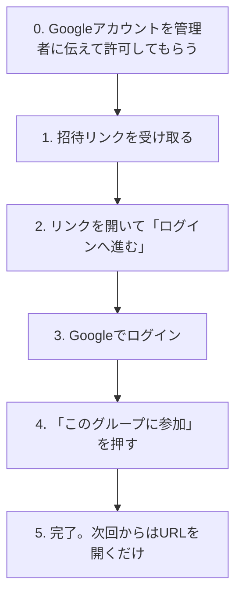

# はじめてのログインガイド

このガイドは、「わが家計」に招待された人が、招待リンクを受け取ってからログインとグループ参加を終えるまでの手順をまとめたものです。スマートフォンでの操作を前提に説明します。

## 必要なもの

- Googleアカウント（Gmailなど）
- グループのオーナーまたは管理者から送られた招待リンク

このアプリは、管理者が許可したGoogleアカウントだけ利用できます。メールアドレスとパスワードによる登録はなく、Googleでのログインがそのまま利用開始になります。

## 全体の流れ



## 0. 事前準備: Googleアカウントを許可してもらう

招待リンクを受け取る前に、利用するGoogleアカウントのメールアドレスを管理者に伝え、許可リストへ登録してもらいます。

- 登録されていないアカウントでログインすると「このGoogleアカウントは利用を許可されていません。」と表示され、先へ進めません。
- Googleアカウントを複数持っている場合は、どのアカウントを伝えたかを覚えておいてください。ログイン時に同じアカウントを選ぶ必要があります。

## 1. 招待リンクを受け取る

グループのオーナーまたは管理者が招待リンクを作成し、LINEやメッセージアプリなど安全な方法で送ってくれます。アプリからメールが届くことはありません。

リンクは次のような形です。

```text
https://<アプリのURL>/invitations/accept#token=...
```

受け取ったら、次の点に注意してください。

- 有効期限は作成から72時間です。期限を過ぎたら作り直してもらいます。
- リンクは1人が1回だけ使えます。ほかの人に転送しないでください。
- 作成者もリンクを再表示できません。なくした場合は新しく作ってもらいます。
- リンクの末尾（`#token=`より後ろ）が欠けるとリンクが無効になります。コピーするときは全体を選択してください。

## 2. 招待リンクを開く

スマートフォンのブラウザで招待リンクを開くと「家計を共有する」という画面が表示されます。

まだログインしていない場合は「参加するには、許可されたGoogleアカウントでログインしてください。」と表示されるので、「ログインへ進む」をタップします。

ログインが終わるまで、同じタブのまま操作を続けてください。別のタブや別のブラウザで開き直すと招待の情報が引き継がれず、リンクを開き直す必要があります。

## 3. Googleでログイン

ログイン画面で「Googleでログイン」をタップします。

1. Googleの画面が開くので、手順0で許可してもらったアカウントを選びます。
2. 求められた場合は、Googleの画面でパスワードや2段階認証を入力します。アプリ側にパスワードを入力することはありません。
3. 初めてのログインでは、アプリのアカウントが自動で作られます。表示名にはGoogleアカウントの名前がそのまま使われ、あとから変更できます。

ログインが終わると、自動的に招待の画面へ戻ります。

## 4. グループに参加する

「参加すると、このグループの家計データをほかのメンバーと共有できます。」という説明の下にある「このグループに参加」をタップします。

「グループへ参加しました。」と表示されたあと、グループのメンバー画面へ移動します。自分の名前がメンバー一覧に載っていれば参加完了です。

## 5. 完了後の使い方

- 次回からはアプリのURLを開くだけで、ログイン状態が続いていればそのままホーム画面が表示されます。
- ログアウトした場合や長期間使わなかった場合は、もう一度「Googleでログイン」を押してください。招待リンクは不要で、参加済みのグループがそのまま表示されます。
- 毎日使うなら、ブラウザのメニューから「ホーム画面に追加」しておくとアプリのように開けます。

## うまくいかないとき

| 表示されるメッセージ                                       | 原因と対処                                                                                                     |
| ---------------------------------------------------------- | -------------------------------------------------------------------------------------------------------------- |
| このGoogleアカウントは利用を許可されていません。           | 選んだGoogleアカウントが許可されていません。許可してもらったアカウントを選び直すか、管理者へ登録を依頼します。 |
| Googleログインを完了できませんでした。                     | Googleでの認証が途中で止まりました。もう一度「Googleでログイン」を押してください。                             |
| 招待リンクが正しくありません。                             | リンクが欠けているか、別のタブで開き直した状態です。受け取ったリンクをそのまま開き直します。                   |
| 招待リンクの有効期限が切れています。                       | 作成から72時間が過ぎています。新しいリンクを作ってもらいます。                                                 |
| この招待リンクは取り消されています。                       | 作成者がリンクを取り消しました。必要なら新しいリンクを作ってもらいます。                                       |
| この招待リンクはすでに別のユーザーが使用しています。       | 同じリンクをほかの人が使いました。自分用のリンクを新しく作ってもらいます。                                     |
| Google OAuthまたは許可アカウントの設定が完了していません。 | アプリ側の設定が未完了です。利用者側で対処できないので管理者へ連絡します。                                     |

## 招待する側の手順（オーナー・管理者向け）

1. 招待したい人のGoogleアカウントを、あらかじめ許可リストへ登録します。登録手順は[デプロイ運用](../operations/deployment.md)の「許可リスト（AUTH_ALLOWED_GOOGLE_EMAILS）のrotation」を参照してください。
2. アプリでグループを開き、「メンバー」画面へ移動します。
3. 「メンバーを招待」で参加後の権限（メンバーまたは管理者）を選び、「招待リンクを作成」を押します。
4. 表示されたリンクを「リンクをコピー」で控えます。リンクはこの画面で1度しか表示されません。
5. LINEなど相手だけが見られる方法でリンクを送ります。
6. 相手が参加すると、メンバー一覧に表示されます。参加前に取りやめたい場合は「保留中の招待」から取り消せます。
