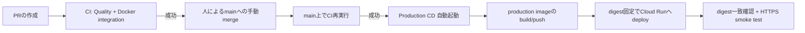

# デプロイ運用

本書は、本番環境（Cloud Run + マネージドSupabase）への日常的なデプロイ運用を説明する。初回構築、Terraformの詳細、GitHub Environmentの設定値は[`infra/terraform/README.md`](../../infra/terraform/README.md)を正本とし、本書は構築完了後の通常運用にフォーカスする。構成の仕様は[`specs/11-production-infrastructure.md`](../../specs/11-production-infrastructure.md)を参照する。

## 全体像



- デプロイの単位は「mainへのmerge」である。mainへのmergeは必ず人が行う（エージェントはPR作成・更新まで）。
- `main`のCIが成功すると、`.github/workflows/deploy-production.yml`（Production CD）が自動で起動する。人が手動でbuild・deployする作業は通常発生しない。
- CDはRepository variable `PRODUCTION_CD_ENABLED=true` のときだけ起動する。未設定または`false`ではjobを安全にskipする。

## 通常デプロイの手順

1. 作業ブランチでPRを作成し、CI（`Quality`と`Docker integration`）の成功を確認する。
2. 人が差分を確認してmainへmergeする。
3. main上のCI成功後、Production CDが自動で次を直列実行する。
   1. CIが検証したcommit SHAをcheckoutする。
   2. Workload Identity Federationで短期credentialを取得する（service account keyは使わない）。
   3. production公開値（`NEXT_PUBLIC_*`）でimageをbuildする。
   4. Artifact Registryへcommit SHA tagでpushし、immutableなdigestを解決する。
   5. `gcloud run deploy --image=<digest>`でimage**だけ**を更新する。
   6. Cloud Runの参照digestが一致することと、`/login`がHTTPSで応答することを確認する。
4. デプロイ完了後、GitHub ActionsのProduction CDが成功していることを確認する。失敗した場合はtrafficが直前のrevisionに残るため、慌てて再実行せずlogから原因を特定する。

### ドキュメントのみの変更はskipされる

変更が`docs/**`、root `README.md`、`CLAUDE.md`のみの場合、CIは`Quality`と`Docker integration`をskipし（format checkは常に実行）、CDは前回deployとの差分を判定して`Build and deploy`をskipする（`INF-017`）。skipされたjobはbranch protectionで合格として扱われるため、docsのみのPRもそのままマージできる。

- 判定の対象と条件は`scripts/docs-only-diff.sh`が正本である。テストが内容を検証する`specs/**`と`AGENTS.md`はドキュメント扱いにならず、変更時は全CIとdeployが実行される。
- CDの差分基準は「`Build and deploy` jobが実際に成功した直近runのcommit」であり、判定できない場合は必ずdeployする（fail open）。
- docsのみの状態でも強制的にdeployしたい場合は、後述の手動デプロイ（`workflow_dispatch`）を使う。手動実行はskip判定を行わず常にdeployする。

### 手動デプロイ

Actionsの`Production CD`をmainに対して`workflow_dispatch`で手動実行できる。CIをbypassするものではなく、mainの現在のHEADをデプロイする。CD失敗後の再実行や、Environment変数を更新した後の再build、docsのみskip後の強制deployに使う。

## CDが行わないこと（重要）

Production CDは**container imageの更新だけ**を行う。次はCDの対象外であり、別の手順で行う。

| 変更対象                                        | 手順                                                                          |
| ----------------------------------------------- | ----------------------------------------------------------------------------- |
| DB schema・RLS（migration）                     | 本番DBへの手動適用。[`database-changes.md`](database-changes.md)を参照        |
| CPU、memory、scaling、環境変数、secret参照、IAM | Terraform（`infra/terraform/environments/prod`）のplan → 人による確認 → apply |
| 許可Googleアカウント一覧                        | Secret Managerのversion追加 + Terraform変数更新 +（DB側は）手動同期           |
| Supabase Auth設定、Google OAuth client          | 各Dashboardでの手動設定                                                       |

このため、**migrationを含む変更はコードのdeployと自動では同期しない**。適用順序の考え方は[`database-changes.md`](database-changes.md)の「本番への適用とデプロイの順序」に従う。

## 公開設定値（NEXT_PUBLIC_*）を変更する場合

`NEXT_PUBLIC_*`はbuild時にbrowser bundleへ固定されるため、build時とruntimeの値を一致させる必要がある。

1. GitHub Environment `production` のvariables／secretを新しい値へ更新する。
2. Terraform `environments/prod` の`terraform.tfvars`（Git管理外）も同じ値へ更新し、plan → 人による確認 → applyでCloud Runのruntime環境変数を更新する。
3. Production CDを手動実行し、新しい値でbuildしたimageをdeployする。
4. build値とruntime値が一致していることをsmoke testで確認する。

## 許可リスト（AUTH_ALLOWED_GOOGLE_EMAILS）のrotation

1. Secret Managerへ新versionを標準入力から追加する（値をshell historyやlogへ残さない）。
2. `environments/prod`の`allowed_google_emails_version`を新しいversion番号へ変更し、plan → apply。
3. 本番DBの`app_private.allowed_google_accounts`も同じ値で手動同期する（[`database-changes.md`](database-changes.md)の「許可リストの同期」を参照）。
4. Google OAuthのログインをsmoke testし、問題がなければ旧versionを無効化する。即時削除はしない。

## ロールバック

アプリの不具合時は、動作確認済みの過去のimage digestへ戻す。

1. 過去のProduction CDのlog、またはArtifact Registryから、動作確認済みdigestを特定する。
2. 権限を持つ運用者が次を実行し、新しいrevisionとして過去imageをdeployする。

```bash
gcloud run deploy CLOUD_RUN_SERVICE --project=GCP_PROJECT_ID --region=asia-northeast1 --image=asia-northeast1-docker.pkg.dev/GCP_PROJECT_ID/account-book/web@sha256:確認済みDIGEST
```

3. digest一致とHTTPS応答を確認する。

注意事項:

- mutable tag（`latest`など）へ戻してはならない。必ずdigestを指定する。
- `initial_container_image`を変更したTerraform applyでロールバックしない。
- **migrationを含む変更はimageだけでは戻せない**。旧コードが新schemaで動くか確認し、必要ならmigration固有の復旧手順（事前dumpからの復元、前方修正migration）を併用する。

## デプロイの一時停止

Repository variable `PRODUCTION_CD_ENABLED`を`false`（または削除）にすると、以降のmerge後CDはrunnerへ送られずskipされる。障害対応中や、migration適用とdeployの順序を制御したい場合に使う。再開時は`true`へ戻す。

## smoke testチェックリスト

デプロイ・rollback・設定変更の後は、最低限次を確認する。

- Cloud Run URLがHTTPSで応答する。
- 未認証状態で保護画面へ入れない。
- 許可GoogleアカウントでOAuthを完了できる。
- 許可外アカウントは登録前hookとcallbackの両方で拒否される。
- 主要フロー（支出登録、カレンダー表示）が幅375pxで完了できる。
- Cloud Loggingにtoken、cookie、許可メール一覧、家計データが出ていない。
- Cloud Runの参照imageが期待するdigestと一致する。

## 障害時の初動

1. GitHub ActionsのCI／Production CDのlogで失敗stepを特定する。
2. Cloud Runのrevision一覧とtraffic割り当てを確認する（deploy失敗時は直前revisionが生きている）。
3. Cloud Loggingでアプリエラーを確認する（秘密情報が含まれないlog設計である前提を保つ）。
4. アプリ起因なら過去digestへrollback、設定起因ならTerraform plan差分を確認する。
5. その場で解決できない場合は、AGENTS.mdのIssue運用に従いIssueを作成する。
