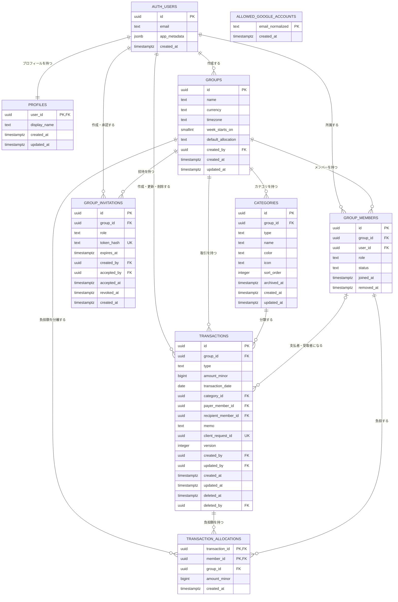

# ER図

状態: 承認済み

バージョン: 0.1.0

最終更新日: 2026-08-28

## 1. 対象と正本

この図は、2026-08-28時点で`supabase/migrations/`に実装済みのテーブルと外部キーを表す。列の制約、RLS、index、将来のデータ設計は`04-data-model.md`、実際のDB構造はmigrationを正本とする。

`auth.users`はSupabase Authが管理する外部schemaである。`app_private.allowed_google_accounts`は認証許可リストであり、email照合に利用するが、`auth.users`との外部キーは持たない。

## 2. 実装済みER図

## 3. 重要な関係と制約

- ユーザーとグループは`group_members`を介した多対多であり、ユーザー行へ単一の`group_id`を持たせない。
- グループ所有データは`group_id`を持ち、RLSの分離境界とする。
- `transactions.category_id`、`payer_member_id`、`recipient_member_id`は、`group_id`を含む複合外部キーで同じグループへ固定する。
- `transaction_allocations.transaction_id`と`member_id`も、`group_id`を含む複合外部キーで同じグループへ固定する。
- 支出では`payer_member_id`だけ、収入では`recipient_member_id`だけを設定する。支出の負担額合計は取引金額と一致させる。
- `group_members`は削除せず`status`を変更し、過去取引との参照を維持する。取引も`deleted_at`による論理削除とする。
- `group_invitations.token_hash`にはhashだけを保存し、生の招待tokenは保存しない。
- カレンダー集計は`transactions`と`transaction_allocations`から読み取り時に計算し、現時点で`daily_summaries`テーブルは作成しない。

## 4. 更新ルール

テーブル、外部キー、グループ境界を変更するmigrationでは、このER図と`04-data-model.md`を同じPRで更新する。図に将来予定のテーブルを実装済みとして描かない。
