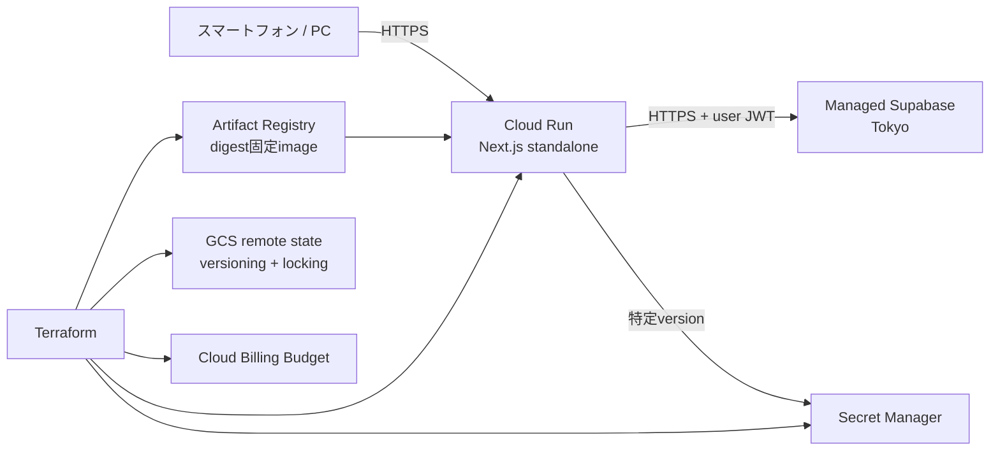

# 本番インフラストラクチャ仕様

状態: 検証済み

バージョン: 0.1.1

最終更新日: 2026-08-29

## 1. 目的

非公開MVPを、低コストかつ再現可能な構成でGoogle Cloudへ配置する。本仕様は`D-007`、`D-008`、`NFR-OPS-003`〜`NFR-OPS-006`、`NFR-PERF-005`、`NFR-SEC-001`、`NFR-SEC-004`、`NFR-SEC-005`を、Terraformの構成と安全な初回構築手順へ具体化する。

今回の変更はIaCコード、構造test、運用資料までとし、実際のGoogle Cloud・Supabase資源の作成、変更、削除は行わない。`terraform apply`は、PR承認後に対象project、請求先、secret、container image、差分planを人が確認して別作業として実行する。

## 2. 要件

- `INF-001`: GCP資源はTerraformで宣言し、環境固有値と秘密値をGit管理対象の`.tf`へ直書きしない。
- `INF-002`: Terraform stateはversioning、uniform bucket-level access、public access preventionを有効にした専用GCS bucketへ保存し、state lockingを利用する。
- `INF-003`: Next.js本番containerは`asia-northeast1`のCloud Run v2 serviceで実行する。
- `INF-004`: Cloud Runは1 vCPU、512 MiB、request-based billing、最小instance 0、最大instance 3を既定値とする。
- `INF-005`: container imageは同一regionのprivate Artifact Registryに保存し、production deployではtagだけでなくdigestを含む参照を必須とする。
- `INF-006`: Cloud Runは専用service accountを使い、service account keyを作成しない。secretごとのSecret Manager accessor以外の権限をruntime identityへ付与しない。
- `INF-007`: 許可Googleアカウント一覧はSecret Managerへ保存し、Cloud Runでは`latest`でなく指定versionを環境変数`AUTH_ALLOWED_GOOGLE_EMAILS`として参照する。Terraformはsecret containerを管理するがsecret payloadを管理しない。
- `INF-008`: Cloud RunはインターネットからHTTPSで到達可能とする。Cloud Run自体は公開invokerとし、アプリケーションのGoogle OAuth、許可リスト、membership、RLSを最終的な認証・認可境界とする。
- `INF-009`: 請求budgetと段階的なthresholdをTerraformで宣言できるようにする。budget通知は費用の強制上限ではないことを運用資料へ明記する。
- `INF-010`: production deploy前に、managed SupabaseをTokyo regionで用意し、Google provider、正確なSite URL・Redirect URL、Before User Created Hook、migration、RLSを確認する。
- `INF-011`: Terraformのformat、初期化、validateと安全性に関する構造testを、実credentialと実cloud変更なしで再現できるようにする。
- `INF-012`: 各PRのplan確認と人によるapplyを初期運用とし、長期credentialやproduction secretをGitHub Actionsへ渡さない。自動deployとWorkload Identity FederationはMVP稼働後の別仕様とする。
- `INF-013`: `.terraform`、state、plan、実値tfvars、backend設定をproduction Docker build contextから除外し、image layerへ混入させない。

## 3. 対象構成



### 3.1 Terraform rootの分離

`infra/terraform`配下を次の独立したrootに分ける。

| root                | 責務                                                                                                  | state                                                 |
| ------------------- | ----------------------------------------------------------------------------------------------------- | ----------------------------------------------------- |
| `bootstrap`         | API有効化、state bucket、Artifact Registry、runtime service account、secret container、billing budget | 初回はlocal state。bucket作成後に同じbucketへ移行する |
| `environments/prod` | Cloud Run v2 service、secret参照、public invoker                                                      | `bootstrap`で作成したGCS bucketの別prefix             |

`bootstrap`と`prod`はstateを分け、アプリrevision更新がstate bucketやrepositoryの削除計画へ波及しないようにする。`prod`は資源名を入力として既存のfoundation資源を参照し、remote state outputへ密結合しない。

### 3.2 Google Cloud資源

`bootstrap`は次を管理する。

- 必要API: Service Usage、Cloud Run、Artifact Registry、Secret Manager、Cloud Resource Manager、Cloud Billing Budget、Cloud Storage
- Terraform state用GCS bucket
- Docker形式のArtifact Registry repository
- Cloud Run runtime専用service account
- `AUTH_ALLOWED_GOOGLE_EMAILS`用Secret Manager secret containerとsecret単位IAM
- projectを対象にした月額budgetと50%、80%、100%のthreshold

`environments/prod`は次を管理する。

- `google_cloud_run_v2_service`
- production trafficを最新revisionへ100%送る設定
- 公開invokerのIAM member
- runtime設定とsecret version参照

### 3.3 管理対象外

次はこのIaCの対象外とする。

- GCP projectとbilling accountそのものの作成・組織IAM
- Google OAuth clientの作成とclient secret
- Supabase organization、production project、Auth provider、Auth Hookの作成・変更
- DB schemaとRLS。引き続き`supabase/migrations`を正本とする
- custom domain、external load balancer、Cloud CDN、VPC connector、Cloud SQL
- container imageのbuild・push・自動deploy workflow
- DB自動backup、監視SLO、paging、preview環境

Supabase Terraform Providerは利用可能だがPublic Alphaであり、現状はproject、branch、settingsに対象が限定される。Google OAuth secretとBefore User Created Hookを含む初回設定を安全かつ完全に再現できないため、非公開MVPでは運用checklistで管理する。安定性と管理対象を再評価してから別PRで導入する。

## 4. Cloud Run仕様

### 4.1 実行設定

| 項目                  | 値                                            |
| --------------------- | --------------------------------------------- |
| region                | `asia-northeast1`                             |
| execution environment | Gen2                                          |
| CPU / memory          | 1 vCPU / 512 MiB                              |
| billing               | request-based (`cpu_idle = true`)             |
| autoscaling           | min 0 / max 3                                 |
| ingress               | all                                           |
| transport             | Cloud Run既定HTTPS endpoint                   |
| container port        | 8080を宣言し、Cloud Runが注入する`PORT`を利用 |
| identity              | 専用runtime service account、keyなし          |
| deletion protection   | productionでは有効                            |

`min = 0`のためcold startは許容する。最大instance数は費用と依存先負荷を抑えるための上限であり、急激な同時利用時には遅延または拒否が生じうる。利用者拡大時は負荷測定後に変更する。

### 4.2 container image

image入力は次の形式だけを受け入れる。

```text
asia-northeast1-docker.pkg.dev/<project>/<repository>/<image>@sha256:<64桁hex>
```

`latest`などのmutable tagをCloud Run stateへ保存しない。rollbackは、動作確認済みの過去digestを変数へ戻してplan・applyする。

本アプリの`NEXT_PUBLIC_*`はNext.jsの仕様により`next build`時にbrowser bundleへ固定される。そのためproduction imageは次の公開値をproduction用の値としてbuildしたものに限る。Cloud Runにも同じ値をruntime環境変数として設定し、Server Componentとbrowser bundleの不一致を防ぐ。

- `NEXT_PUBLIC_SITE_URL`
- `NEXT_PUBLIC_SUPABASE_URL`
- `NEXT_PUBLIC_SUPABASE_ANON_KEY`
- `NEXT_PUBLIC_GOOGLE_OAUTH_ENABLED=true`

これらはbrowserへ公開される設定でありsecretとして扱わない。ただし値をTerraform sourceへ直書きせず、Git管理外の`terraform.tfvars`または`TF_VAR_*`から渡す。`GOOGLE_OAUTH_CLIENT_SECRET`、Supabase access token、service role keyをcontainer imageへ含めてはならない。

### 4.3 runtime環境変数

| 変数                               | 供給元                      | 性質                             |
| ---------------------------------- | --------------------------- | -------------------------------- |
| `NEXT_PUBLIC_SITE_URL`             | Terraform input             | 公開。build時とruntimeで同一     |
| `NEXT_PUBLIC_SUPABASE_URL`         | Terraform input             | 公開。managed Supabase HTTPS URL |
| `NEXT_PUBLIC_SUPABASE_ANON_KEY`    | Terraform input             | 公開可能なpublishable/anon key   |
| `NEXT_PUBLIC_GOOGLE_OAUTH_ENABLED` | Terraform固定値`true`       | 公開feature flag                 |
| `AUTH_ALLOWED_GOOGLE_EMAILS`       | Secret Managerの指定version | server-only secret               |

Cloud Runが予約する`PORT`をTerraformから上書きしない。`SUPABASE_INTERNAL_URL`は本番では指定せず、公開Supabase URLをserver accessにも利用する。

## 5. secretとstateの安全性

- Terraform source、tfvars example、plan artifact、output、logへsecret payloadを書かない。
- Secret Manager secret versionはTerraform外で安全な標準入力から追加する。command line argumentへpayloadを直接書かない。
- Cloud Runのsecret環境変数はversion番号を明示し、rotationは「version追加 → Terraform変数更新 → plan → apply → smoke test → 旧version無効化」の順で行う。
- runtime service accountへの`roles/secretmanager.secretAccessor`は対象secretだけに付与する。
- state bucketはpublic access prevention、uniform bucket-level access、versioningを有効にし、`force_destroy = false`と削除防止を設定する。
- backend credentialはApplication Default Credentialsまたはservice account impersonationを使う。service account key JSONを作成・保存しない。
- `.terraform/`、`*.tfstate*`、`*.tfplan`、実値の`*.tfvars`とbackend設定はGit管理外とする。
- 同じTerraform生成物と実値を`.dockerignore`でも除外し、production Docker daemonへ送らない。

## 6. production前提条件

`prod`のplan前に次を満たす。

1. GCP projectにbillingが紐付き、操作者が対象権限とApplication Default Credentialsを持つ。
2. `bootstrap`をapplyし、stateをversioning済みGCS backendへ移行する。
3. Secret Managerへ許可Googleアカウント一覧のversionを追加する。
4. managed Supabase projectをTokyo regionで用意する。
5. production migrationを適用し、RLSとBefore User Created Hookを検証する。
6. Supabase AuthのSite URLをCloud Runの正確なHTTPS origin、Redirect URLを`<origin>/auth/callback`にする。
7. Google Auth Platformで本番用clientを分離し、Authorized JavaScript originsへCloud Run origin、Authorized redirect URIへSupabase Dashboardが示すcallback URLを正確に登録する。
8. 4つの`NEXT_PUBLIC_*`値をproduction用に設定してimageをbuildし、Artifact Registryへpushしてdigestを取得する。
9. `prod`の変数へ同じ公開値、secret version、image digestを設定する。
10. 保存した`terraform plan`を人が確認してからapplyする。

Cloud Runの恒久URLはservice作成後に確定するため、初回だけ「仮imageでservice作成 → 出力URLをOAuth・Supabase・build設定へ反映 → production image digestで更新」の二段階を許容する。custom domain導入後はそのoriginを固定値にする。

## 7. 費用と復旧

- Cloud Runはrequest-based billingかつmin 0とし、無通信時の常時instance費用を避ける。
- max 3で意図しないscale outを制限する。
- Artifact Registry cleanup policyで、直近の一定数を残して古いuntagged imageを削除する。dry-runを既定とし、実削除へ変更する前に対象を確認する。
- billing budgetは通知であり、課金を停止するhard capではない。異常時はCloud Run停止、billing無効化、または別途spend capを人が判断する。
- Terraform stateはGCS object versioningで復旧可能にする。
- DBは`D-008`どおり自動backupをMVP必須にせず、高risk migration前のmanual dump、logical delete、CSV exportを使う。Terraform stateのversioningはDB backupとは別目的である。

## 8. 適用・変更手順

各rootで次を行う。

```text
terraform fmt -check -recursive
terraform init -backend=false
terraform validate
terraform plan -out=<Git管理外のplan file>
人によるplan確認
terraform apply <確認済みplan file>
```

`apply -auto-approve`、通常運用での`-target`、secretを含む`-var`直書きは使用しない。bootstrap初回とbackend移行手順は`infra/terraform/README.md`を正本とする。

apply後は次をsmoke testする。

- Cloud Run URLがHTTPSで応答する。
- 未認証利用者が保護画面を閲覧できない。
- 許可アカウントはGoogle OAuthを完了できる。
- 許可外アカウントは作成前hookとcallbackで拒否される。
- 2人が同じgroupを共有でき、別groupのデータを閲覧できない。
- Cloud Loggingにtoken、cookie、許可メール一覧、家計データが出ていない。
- Cloud Runのmin/max、CPU、memory、service account、image digest、secret versionがplanどおりである。

## 9. 受け入れ条件

- `AC-INF-001-1`: `bootstrap`と`environments/prod`が独立したTerraform rootとして存在し、責務とstateが分離されている。
- `AC-INF-001-2`: Cloud RunがTokyo、Gen2、1 vCPU、512 MiB、request-based billing、min 0、max 3、deletion protectionで宣言されている。
- `AC-INF-001-3`: production image変数がArtifact Registryのdigest参照以外を拒否する。
- `AC-INF-001-4`: runtime service accountがkeyを持たず、対象secretだけにaccessorを持つ。
- `AC-INF-001-5`: secret payloadをTerraform stateへ保存せず、Cloud Runが指定versionを参照する。
- `AC-INF-001-6`: state bucketがversioning、uniform bucket-level access、public access prevention、削除防止を持つ。
- `AC-INF-001-7`: budget threshold、Artifact Registry、必要APIがbootstrapで宣言されている。
- `AC-INF-001-8`: public invokerを除き、project-levelの広いruntime IAM roleがない。
- `AC-INF-001-9`: `.terraform`、state、plan、実値tfvars、credentialがGit対象外である。
- `AC-INF-001-10`: 実credentialなしの構造test、`terraform fmt -check -recursive`、両rootの`terraform init -backend=false`と`terraform validate`が成功する。
- `AC-INF-001-11`: 運用資料が初回構築、backend移行、secret登録、image build、plan review、rollback、smoke test、Supabase/OAuth前提を説明する。
- `AC-INF-001-12`: PRでは実cloud資源を変更せず、applyに必要な実値とsecretをコミットしない。
- `AC-INF-001-13`: Terraform Provider cache、state、plan、実値tfvars、backend設定がproduction Docker build contextから除外されている。

## 10. worktree境界

本変更は専用worktreeと`feat/terraform-cloud-run`ブランチで行う。競合を避けるため、変更を次へ限定する。

変更を許可する範囲:

- `infra/terraform/**`
- `specs/README.md`
- `specs/09-spec-review.md`
- `specs/11-production-infrastructure.md`
- `tests/architecture/terraform-foundation.test.mjs`
- Terraform生成物を除外するための`.gitignore`
- Terraform生成物をbuild contextから除外するための`.dockerignore`
- production build契約に必要な場合だけroot `Dockerfile`

変更しない範囲:

- `src/**`
- `supabase/migrations/**`
- `compose.yaml`
- `.github/workflows/**`
- `package.json`とlockfile
- Claude Code側が実装中の履歴、CSV、メンバー、カテゴリ機能

dependency追加、migration番号、共通UI、routeは本変更で予約しない。
