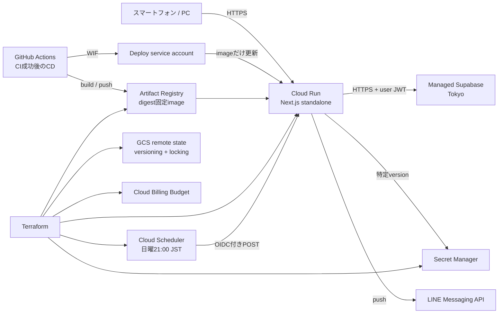

# 本番インフラストラクチャ仕様

状態: 実装承認済み（LINE週次レポート向け追加分 review: 2026-09-07-line-weekly-report-infra）

バージョン: 0.5.0

最終更新日: 2026-09-07

## 1. 目的

非公開MVPを、低コストかつ再現可能な構成でGoogle Cloudへ配置する。本仕様は`D-007`、`D-008`、`NFR-OPS-003`〜`NFR-OPS-006`、`NFR-PERF-005`、`NFR-SEC-001`、`NFR-SEC-004`、`NFR-SEC-005`を、Terraformの構成と安全な初回構築手順へ具体化する。

今回の変更はIaCコード、GitHub Actionsのproduction CD、構造test、運用資料までとし、実際のGoogle Cloud・Supabase資源の作成、変更、削除は行わない。`terraform apply`は、PR承認後に対象project、請求先、secret、初回container image、差分planを人が確認して別作業として実行する。通常のアプリrevisionは、mainのCI成功後にGitHub ActionsがWorkload Identity Federationで認証して更新する。

## 2. 要件

- `INF-001`: GCP資源はTerraformで宣言し、環境固有値と秘密値をGit管理対象の`.tf`へ直書きしない。
- `INF-002`: Terraform stateはversioning、uniform bucket-level access、public access preventionを有効にした専用GCS bucketへ保存し、state lockingを利用する。
- `INF-003`: Next.js本番containerは`asia-northeast1`のCloud Run v2 serviceで実行する。
- `INF-004`: Cloud Runは1 vCPU、512 MiB、request-based billing、最小instance 0、最大instance 3を既定値とする。
- `INF-005`: container imageは同一regionのprivate Artifact Registryに保存し、production deployではtagだけでなくdigestを含む参照を必須とする。
- `INF-006`: Cloud Runは専用service accountを使い、service account keyを作成しない。secretごとのSecret Manager accessor以外の権限をruntime identityへ付与しない。
- `INF-007`: 許可Googleアカウント一覧はSecret Managerへ保存し、Cloud Runでは`latest`でなく指定versionを環境変数`AUTH_ALLOWED_GOOGLE_EMAILS`として参照する。Terraformはsecret containerを管理するがsecret payloadを管理しない。
- `INF-008`: Cloud RunはインターネットからHTTPSで到達可能とする。Cloud Run自体は公開invokerとし、アプリケーションのGoogle OAuth、許可リスト、membership、RLSを最終的な認証・認可境界とする。
- `INF-009`: 請求budgetと段階的なthresholdをTerraformで宣言できるようにする。budget通知は費用の強制上限ではないことを運用資料へ明記する。
- `INF-010`: production deploy前に、managed SupabaseをTokyo regionで用意し、Google provider、正確なSite URL・Redirect URL、Before User Created Hook、migration、RLSを確認する。
- `INF-011`: Terraformのformat、初期化、validateと安全性に関する構造testを、実credentialと実cloud変更なしで再現できるようにする。
- `INF-012`: foundationとCloud Runの固定service構成は、保存したplanを人が確認してTerraformでapplyする。通常のアプリrevisionは、mainのCI成功後にGitHub Actionsがbuild、Artifact Registryへのpush、digest固定deploy、smoke testを行う。
- `INF-013`: `.terraform`、state、plan、実値tfvars、backend設定、GitHub WIF Actionが一時生成する`gha-creds-*.json`をproduction Docker build contextから除外し、image layerへ混入させない。
- `INF-014`: TerraformはCloud Run作成時の初回imageだけを要求し、その後のcontainer image変更を無視する。GitHub Actionsはimageだけを更新し、CPU、memory、scaling、環境変数、secret、service identity、ingress、IAMを変更しない。
- `INF-015`: GitHub Actionsはservice account keyを使わず、再利用されないnumeric repository ID・owner IDとmain branchへ制約したWorkload Identity Federationから専用deploy service accountをimpersonateする。deploy identityにはArtifact Registryへのpush、既存Cloud Run serviceのrevision更新、runtime identityの利用に必要な最小権限だけを付与する。
- `INF-016`: production CDはRepository variable `PRODUCTION_CD_ENABLED=true`を明示した場合だけ起動し、GitHub Environment `production`の接続値・secret・保護規則を使って同時deployを直列化する。実値tfvarsやcredential fileをGitへ追加せず、許可Googleアカウント一覧、Google OAuth client secret、Supabase service role keyをworkflowへ渡さない。
- `INF-017`: 変更がアプリの挙動に影響しないドキュメント（`docs/**`、root `README.md`、`CLAUDE.md`）のみの場合、CIはformat検証だけを実行して重い検証ジョブをskipし、production CDは実際にdeployへ成功した直近commitとの差分で判定してdeployをskipする。testが内容を検証する`specs/**`と`AGENTS.md`はドキュメント扱いにしない。docsのみ判定は単一のscriptへ集約し、初回・判定不能・手動実行では必ず検証とdeployを実行する側へ倒す。
- `INF-018`: 許可Googleアカウント一覧の変更（追加・削除）は、Secret Managerへの新version追加、`environments/prod`のversion変数更新、plan確認後のapply、本番DBの`app_private.allowed_google_accounts`同期、smoke test、旧version無効化の順で行う。version追加とDB同期は`scripts/rotate-allowed-google-emails.sh`で行い、値は標準入力またはSecret Managerから取得したものだけを使い、command line引数、shell history、log、標準出力へ出さない。DB同期はSecret Managerの同じversionから値を取得し、手入力の二重化による不一致を作らない。runbookは`docs/operations/allowed-google-emails.md`を正本とする。

LINE週次レポート（[`16-line-weekly-report.md`](16-line-weekly-report.md)、`NOTIF-*`）の段階2として、次を追加する。`INF-018`と`AC-INF-001-21`〜`AC-INF-001-23`は許可リストrotation補助（`chore/allowed-google-emails-rotation`）で採番済みのため、本追加分は`INF-019`以降を使う。

- `INF-019`: LINE週次レポート用の秘密値（LINE channel secret、LINE channel access token、通知専用ロールのDB接続文字列）は、`bootstrap`が管理する3つのSecret Manager secret containerへ格納する。payloadはTerraform管理外とし、runtime service accountへの`roles/secretmanager.secretAccessor`はsecret単位で付与する。
- `INF-020`: 週次ジョブの起動には、`bootstrap`が作成するCloud Scheduler専用service account（keyなし）を使う。`environments/prod`はCloud Scheduler job（毎週日曜21:00 `Asia/Tokyo`、HTTP POST、OIDC token）を宣言し、audienceと呼び出し先URLを同じ値（`<site_url>/api/v1/jobs/weekly-line-report`）から導出する。Cloud Runは公開invokerのため、scheduler service accountへ`roles/run.invoker`やproject-levelの権限を付与しない。認可はアプリ側のOIDC検証（`NOTIF-006`）が担う。
- `INF-021`: LINE週次レポートの構成は`environments/prod`の単一変数（既定`null`）で有効・無効を切り替える。無効時は環境変数・secret参照・Cloud Scheduler jobを一切作成せず、既存構成のplanに差分を出さない。有効時は`LINE_CHANNEL_SECRET`・`LINE_CHANNEL_ACCESS_TOKEN`・`NOTIFIER_DATABASE_URL`をSecret Managerの指定version（`latest`不可）で、`LINE_WEEKLY_REPORT_GROUP_ID`・`LINE_WEEKLY_REPORT_JOB_AUDIENCE`・`LINE_WEEKLY_REPORT_JOB_INVOKER`を平文の環境変数としてCloud Runへ渡す。有効化の順序は「bootstrap apply → secret version登録 → prod変数設定 → plan確認 → apply」とし、secret versionが存在しない状態でprodを有効化しない。

## 3. 対象構成



### 3.1 Terraform rootの分離

`infra/terraform`配下を次の独立したrootに分ける。

| root                | 責務                                                                                                              | state                                                 |
| ------------------- | ----------------------------------------------------------------------------------------------------------------- | ----------------------------------------------------- |
| `bootstrap`         | API有効化、state bucket、Artifact Registry、runtime/deploy service account、WIF、secret container、billing budget | 初回はlocal state。bucket作成後に同じbucketへ移行する |
| `environments/prod` | Cloud Run v2 service、secret参照、public invoker                                                                  | `bootstrap`で作成したGCS bucketの別prefix             |

`bootstrap`と`prod`はstateを分け、アプリrevision更新がstate bucketやrepositoryの削除計画へ波及しないようにする。`prod`は資源名を入力として既存のfoundation資源を参照し、remote state outputへ密結合しない。

### 3.2 Google Cloud資源

`bootstrap`は次を管理する。

- 必要API: Service Usage、Cloud Run、Artifact Registry、Secret Manager、Cloud Resource Manager、Cloud Billing Budget、Cloud Storage
- Terraform state用GCS bucket
- Docker形式のArtifact Registry repository
- Cloud Run runtime専用service account
- GitHub Actions deploy専用service account
- 対象repository・ownerの不変numeric IDとmain branchだけを信頼するWorkload Identity PoolとGitHub OIDC provider
- deploy identityに対するrepository単位のArtifact Registry Writerとruntime identity単位のService Account User
- `AUTH_ALLOWED_GOOGLE_EMAILS`用Secret Manager secret containerとsecret単位IAM
- LINE週次レポート用の3つのSecret Manager secret container（channel secret、channel access token、通知専用DB接続文字列）とsecret単位IAM（`INF-019`）
- Cloud Scheduler APIの有効化とCloud Scheduler専用service account（`INF-020`）
- projectを対象にした月額budgetと50%、80%、100%のthreshold

`environments/prod`は次を管理する。

- `google_cloud_run_v2_service`
- production trafficを最新revisionへ100%送る設定
- 公開invokerのIAM member
- runtime設定とsecret version参照
- deploy identityに対する対象Cloud Run service単位のCloud Run Developer
- LINE週次レポートを有効化した場合だけ、通知用の環境変数6つとCloud Scheduler job（`INF-020`、`INF-021`）

### 3.3 管理対象外

次はこのIaCの対象外とする。

- GCP projectとbilling accountそのものの作成・組織IAM
- Google OAuth clientの作成とclient secret
- Supabase organization、production project、Auth provider、Auth Hookの作成・変更
- DB schemaとRLS。引き続き`supabase/migrations`を正本とする
- custom domain、external load balancer、Cloud CDN、VPC connector、Cloud SQL
- DB自動backup、監視SLO、paging、preview環境

Supabase Terraform Providerは利用可能だがPublic Alphaであり、現状はproject、branch、settingsに対象が限定される。Google OAuth secretとBefore User Created Hookを含む初回設定を安全かつ完全に再現できないため、非公開MVPでは運用checklistで管理する。安定性と管理対象を再評価してから別PRで導入する。

## 4. Cloud Run仕様

### 4.1 実行設定

| 項目                  | 値                                            |
| --------------------- | --------------------------------------------- |
| region                | `asia-northeast1`                             |
| execution environment | Gen2                                          |
| CPU / memory          | 1 vCPU / 512 MiB                              |
| billing               | request-based (`cpu_idle = true`)             |
| autoscaling           | min 0 / max 3                                 |
| ingress               | all                                           |
| transport             | Cloud Run既定HTTPS endpoint                   |
| container port        | 8080を宣言し、Cloud Runが注入する`PORT`を利用 |
| identity              | 専用runtime service account、keyなし          |
| deletion protection   | productionでは有効                            |

`min = 0`のためcold startは許容する。最大instance数は費用と依存先負荷を抑えるための上限であり、急激な同時利用時には遅延または拒否が生じうる。利用者拡大時は負荷測定後に変更する。

### 4.2 container imageと管理境界

Terraformの初回image入力とGitHub Actionsがdeployするimageは、次の形式だけを受け入れる。

```text
asia-northeast1-docker.pkg.dev/<project>/<repository>/<image>@sha256:<64桁hex>
```

`latest`などのmutable tagをCloud Runへdeployしない。Terraformはservice作成に必要な`initial_container_image`だけを保持し、`lifecycle.ignore_changes`でcontainer imageだけを管理対象外にする。image以外のtemplate全体を無視してはならない。通常deployとrollbackはGitHub Actionsが動作確認済みdigestを指定して新しいrevisionを作る。Terraform applyでアプリrevisionを戻さない。

本アプリの`NEXT_PUBLIC_*`はNext.jsの仕様により`next build`時にbrowser bundleへ固定される。そのためproduction imageは次の公開値をproduction用の値としてbuildしたものに限る。Cloud Runにも同じ値をruntime環境変数として設定し、Server Componentとbrowser bundleの不一致を防ぐ。

- `NEXT_PUBLIC_SITE_URL`
- `NEXT_PUBLIC_SUPABASE_URL`
- `NEXT_PUBLIC_SUPABASE_ANON_KEY`
- `NEXT_PUBLIC_GOOGLE_OAUTH_ENABLED=true`

これらはbrowserへ公開される設定でありsecretとして扱わない。ただし値をTerraform sourceへ直書きせず、Terraformの手動適用ではGit管理外の`terraform.tfvars`、GitHub Actionsのbuildでは`production` Environmentのvariablesまたはsecretから渡す。build時とruntimeの値を一致させる。`GOOGLE_OAUTH_CLIENT_SECRET`、Supabase access token、service role keyをworkflowやcontainer imageへ含めてはならない。

### 4.3 GitHub Actions CD

production CDは、初期構築とEnvironment設定が完了し、Repository variable `PRODUCTION_CD_ENABLED=true`となった後、既存CI workflowのmain commit成功時、またはmainを対象とした手動実行でだけ開始する。未設定または`false`ではjobをrunnerへ送らず安全にskipする。接続値とsecretは`production` Environmentへ置き、承認・branch保護を適用できるjobとする。同時実行はcancelせず1件ずつ処理する。

workflowは次だけを行う。

1. CIが検証したcommit SHAをcheckoutする。
2. GitHub OIDC tokenをWIFで短期Google credentialへ交換する。
3. production用`NEXT_PUBLIC_*`でimageをbuildする。
4. commit SHA tagでArtifact Registryへpushし、解決したdigestを取得する。
5. 対象serviceへdigestを指定し、imageだけを更新する。
6. serviceがそのdigestを参照することと、HTTPS endpointが応答することを確認する。

workflowから`--set-env-vars`、`--update-secrets`、`--service-account`、CPU・memory・scaling・ingress・IAMを変更するflagを渡さない。GitHub Actionsが追加する管理labelもTerraformとの競合を避けるため付けない。deploy失敗時は直前revisionへのtrafficを維持し、確認済みの過去digestを指定する手動rollbackを可能にする。

変更がドキュメント（`docs/**`、root `README.md`、`CLAUDE.md`）のみの場合、CIは重い検証ジョブをskipし、CDは`Build and deploy` jobが最後に成功したrunのcommitとの差分がdocsのみであればdeployをskipする（`INF-017`）。deployをskipしたrunや失敗したrunは差分の基準にしない。基準commitを特定できない場合は必ずdeployし、`workflow_dispatch`の手動実行はこの判定を行わず常にdeployする。

### 4.4 runtime環境変数

| 変数                               | 供給元                      | 性質                                     |
| ---------------------------------- | --------------------------- | ---------------------------------------- |
| `NEXT_PUBLIC_SITE_URL`             | Terraform input             | 公開。build時とruntimeで同一             |
| `NEXT_PUBLIC_SUPABASE_URL`         | Terraform input             | 公開。managed Supabase HTTPS URL         |
| `NEXT_PUBLIC_SUPABASE_ANON_KEY`    | Terraform input             | 公開可能なpublishable/anon key           |
| `NEXT_PUBLIC_GOOGLE_OAUTH_ENABLED` | Terraform固定値`true`       | 公開feature flag                         |
| `AUTH_ALLOWED_GOOGLE_EMAILS`       | Secret Managerの指定version | server-only secret                       |
| `LINE_CHANNEL_SECRET`              | Secret Managerの指定version | server-only secret。有効化時のみ         |
| `LINE_CHANNEL_ACCESS_TOKEN`        | Secret Managerの指定version | server-only secret。有効化時のみ         |
| `NOTIFIER_DATABASE_URL`            | Secret Managerの指定version | server-only secret。有効化時のみ         |
| `LINE_WEEKLY_REPORT_GROUP_ID`      | Terraform input             | 通知対象の家計グループUUID。有効化時のみ |
| `LINE_WEEKLY_REPORT_JOB_AUDIENCE`  | `site_url`から導出          | ジョブURL。schedulerのaudienceと同一     |
| `LINE_WEEKLY_REPORT_JOB_INVOKER`   | bootstrapのSA参照           | scheduler service accountのemail         |

Cloud Runが予約する`PORT`をTerraformから上書きしない。`SUPABASE_INTERNAL_URL`は本番では指定せず、公開Supabase URLをserver accessにも利用する。

`LINE_*`と`NOTIFIER_DATABASE_URL`は、`environments/prod`の`line_weekly_report`変数が`null`（既定）の間は宣言されず、アプリは`NOTIF-010`のfail closedで通知機能を無効にする。有効化するとき、`LINE_WEEKLY_REPORT_JOB_AUDIENCE`とCloud Scheduler jobのURL・audienceは同じlocal値から導出し、手入力の不一致で`NOTIF-006`の検証が失敗しないようにする。

### 4.5 Cloud Scheduler job

| 項目             | 値                                                                  |
| ---------------- | ------------------------------------------------------------------- |
| schedule         | `0 21 * * 0`（毎週日曜21:00）                                       |
| time zone        | `Asia/Tokyo`                                                        |
| target           | HTTP POST `<site_url>/api/v1/jobs/weekly-line-report`               |
| 認証             | OIDC token。service accountはbootstrapのscheduler SA、audienceはURL |
| retry            | 3回、初回backoff 5分、最大1時間                                     |
| attempt deadline | 180秒                                                               |
| 停止             | `line_weekly_report.paused = true`でjobをpauseする（Terraform管理） |

ジョブは`NOTIF-008`により冪等なため、リトライや手動実行で二重送信しない。jobの作成・変更にはapply実行者がscheduler service accountへの`iam.serviceAccounts.actAs`を持つ必要がある（project ownerは満たす）。

## 5. secretとstateの安全性

- Terraform source、tfvars example、plan artifact、output、logへsecret payloadを書かない。
- Secret Manager secret versionはTerraform外で安全な標準入力から追加する。command line argumentへpayloadを直接書かない。
- Cloud Runのsecret環境変数はversion番号を明示し、rotationは「version追加 → Terraform変数更新 → plan → apply → DB同期 → smoke test → 旧version無効化」の順で行う（`INF-018`）。Cloud Runのtrafficは最新revisionへ向くが、secret参照は`latest`にしない。同一revision内でinstanceごとに許可リストが食い違うこと、旧revisionへのrollbackで許可リストが戻らないこと、レビューなしに本番の認可情報が変わることを防ぐためである。
- runtime service accountへの`roles/secretmanager.secretAccessor`は対象secretだけに付与する。
- state bucketはpublic access prevention、uniform bucket-level access、versioningを有効にし、`force_destroy = false`と削除防止を設定する。
- backend credentialはApplication Default Credentialsまたはservice account impersonationを使う。service account key JSONを作成・保存しない。
- GitHub ActionsはOIDCとWorkload Identity Federationを使い、長期service account key JSONをGitHub Secretsへ保存しない。
- `.terraform/`、`*.tfstate*`、`*.tfplan`、実値の`*.tfvars`とbackend設定はGit管理外とする。
- 同じTerraform生成物と実値を`.dockerignore`でも除外し、production Docker daemonへ送らない。

## 6. production前提条件

`prod`のplan前に次を満たす。

1. GCP projectにbillingが紐付き、操作者が対象権限とApplication Default Credentialsを持つ。
2. `bootstrap`をapplyし、stateをversioning済みGCS backendへ移行する。
3. Secret Managerへ許可Googleアカウント一覧のversionを追加する。
4. managed Supabase projectをTokyo regionで用意する。
5. production migrationを適用し、RLSとBefore User Created Hookを検証する。
6. Supabase AuthのSite URLをCloud Runの正確なHTTPS origin、Redirect URLを`<origin>/auth/callback`にする。
7. Google Auth Platformで本番用clientを分離し、Authorized JavaScript originsへCloud Run origin、Authorized redirect URIへSupabase Dashboardが示すcallback URLを正確に登録する。
8. WIFの対象GitHub repositoryを確認し、`production` Environmentへ公開build値、WIF provider、deploy service accountを設定する。
9. 4つの`NEXT_PUBLIC_*`値をproduction用に設定して初回imageをbuildし、Artifact Registryへpushしてdigestを取得する。
10. `prod`の変数へ同じ公開値、secret version、初回image digestを設定する。
11. 保存した`terraform plan`を人が確認してからapplyする。

Cloud Runの恒久URLはservice作成後に確定するため、初回だけ「初回imageでservice作成 → 出力URLをOAuth・Supabase・build設定へ反映 → production値で再buildしてGitHub Actionsからdigest deploy」の二段階を許容する。custom domain導入後はそのoriginを固定値にする。

## 7. 費用と復旧

- Cloud Runはrequest-based billingかつmin 0とし、無通信時の常時instance費用を避ける。
- max 3で意図しないscale outを制限する。
- Artifact Registry cleanup policyで、直近の一定数を残して古いuntagged imageを削除する。dry-runを既定とし、実削除へ変更する前に対象を確認する。
- billing budgetは通知であり、課金を停止するhard capではない。異常時はCloud Run停止、billing無効化、または別途spend capを人が判断する。
- Terraform stateはGCS object versioningで復旧可能にする。
- DBは`D-008`どおり自動backupをMVP必須にせず、高risk migration前のmanual dump、logical delete、CSV exportを使う。Terraform stateのversioningはDB backupとは別目的である。

## 8. 適用・変更手順

各rootで次を行う。

```text
terraform fmt -check -recursive
terraform init -backend=false
terraform validate
terraform plan -out=<Git管理外のplan file>
人によるplan確認
terraform apply <確認済みplan file>
```

`apply -auto-approve`、通常運用での`-target`、secretを含む`-var`直書きは使用しない。bootstrap初回とbackend移行手順は`infra/terraform/README.md`を正本とする。

apply後は次をsmoke testする。

- Cloud Run URLがHTTPSで応答する。
- 未認証利用者が保護画面を閲覧できない。
- 許可アカウントはGoogle OAuthを完了できる。
- 許可外アカウントは作成前hookとcallbackで拒否される。
- 2人が同じgroupを共有でき、別groupのデータを閲覧できない。
- Cloud Loggingにtoken、cookie、許可メール一覧、家計データが出ていない。
- Cloud Runのmin/max、CPU、memory、service account、secret versionがplanどおりである。
- CD後のCloud Run imageがworkflowで取得したdigestと一致し、後続のTerraform planでimage差分が出ない。

## 9. 受け入れ条件

- `AC-INF-001-1`: `bootstrap`と`environments/prod`が独立したTerraform rootとして存在し、責務とstateが分離されている。
- `AC-INF-001-2`: Cloud RunがTokyo、Gen2、1 vCPU、512 MiB、request-based billing、min 0、max 3、deletion protectionで宣言されている。
- `AC-INF-001-3`: production image変数がArtifact Registryのdigest参照以外を拒否する。
- `AC-INF-001-4`: runtime service accountがkeyを持たず、対象secretだけにaccessorを持つ。
- `AC-INF-001-5`: secret payloadをTerraform stateへ保存せず、Cloud Runが指定versionを参照する。
- `AC-INF-001-6`: state bucketがversioning、uniform bucket-level access、public access prevention、削除防止を持つ。
- `AC-INF-001-7`: budget threshold、Artifact Registry、必要APIがbootstrapで宣言されている。
- `AC-INF-001-8`: public invokerを除き、project-levelの広いruntime IAM roleがない。
- `AC-INF-001-9`: `.terraform`、state、plan、実値tfvars、credentialがGit対象外である。
- `AC-INF-001-10`: 実credentialなしの構造test、`terraform fmt -check -recursive`、両rootの`terraform init -backend=false`と`terraform validate`が成功する。
- `AC-INF-001-11`: 運用資料が初回構築、backend移行、secret登録、image build、plan review、rollback、smoke test、Supabase/OAuth前提を説明する。
- `AC-INF-001-12`: PRでは実cloud資源を変更せず、applyに必要な実値とsecretをコミットしない。
- `AC-INF-001-13`: Terraform Provider cache、state、plan、実値tfvars、backend設定、`gha-creds-*.json`がGitとproduction Docker build contextから除外されている。
- `AC-INF-001-14`: Terraformが`initial_container_image`でserviceを作成し、container imageだけを`ignore_changes`とする。template全体、CPU、memory、scaling、環境変数、secret、identityは無視しない。
- `AC-INF-001-15`: bootstrapがGitHub OIDC用WIF、deploy service account、repository単位Artifact Registry Writer、runtime identity単位Service Account Userを宣言する。WIFはnumeric repository ID・owner IDとmain branchをすべて検証し、service account keyを作らない。
- `AC-INF-001-16`: prodがdeploy identityへ対象Cloud Run service単位のCloud Run Developerだけを付与する。
- `AC-INF-001-17`: production CDがRepository variable `PRODUCTION_CD_ENABLED=true`かつmainのCI成功後またはmainの手動実行だけで起動し、未設定ではjobをskipする。起動時は`production` Environmentを使い、WIF認証、production build、push、digest deploy、image一致確認、HTTPS smoke testを直列実行する。
- `AC-INF-001-18`: CDはimage以外のCloud Run構成を変更するflagを使わず、実値tfvars、長期credential、許可メール一覧、OAuth client secret、Supabase service role keyをworkflowへ含めない。
- `AC-INF-001-19`: docsのみ判定は`scripts/docs-only-diff.sh`に集約され、対象を`docs/**`・root `README.md`・`CLAUDE.md`に限定し、`specs/**`と`AGENTS.md`を含まない。CIの重い検証ジョブは、作業ブランチではmainとの分岐点、mainでは直前commitとの差分がdocsのみの場合だけskipされ、format検証は常に実行される。
- `AC-INF-001-20`: production CDは、`Build and deploy` jobが実際に成功した直近runのcommitとの差分がdocsのみの場合だけdeployをskipする。deployをskipしたrunを基準にせず、基準を特定できない場合と手動実行では必ずdeployする。
- `AC-INF-001-21`: `scripts/rotate-allowed-google-emails.sh add-version`は、標準入力の許可リストを検証（空値・重複・不正形式で中止）してからSecret Managerへ新versionを追加し、Git管理外の`terraform.tfvars`の`allowed_google_emails_version`を新番号へ更新し、続くplan・apply・DB同期・smoke test・旧version無効化のcommandを表示する。許可リストの値をcommand line引数、標準出力、標準エラー出力へ出さない。
- `AC-INF-001-22`: `scripts/rotate-allowed-google-emails.sh sync-db <version>`は、Secret Managerの指定versionから値を取得して同じ検証を行い、psqlの標準入力経由で`app_private.sync_allowed_google_accounts`を実行し、同期件数を表示する。値をpsqlのcommand line引数へ渡さない。
- `AC-INF-001-23`: 上記scriptの検証・tfvars更新・stdin経由の受け渡しは、実credentialと実cloud変更なしにstub commandで構造testできる。runbook `docs/operations/allowed-google-emails.md`が存在し、`deployment.md`、`database-changes.md`、`infra/terraform/README.md`から参照されている。

LINE週次レポート向け（`INF-019`〜`INF-021`。`AC-INF-001-21`〜`AC-INF-001-23`は許可リストrotation補助で採番済み）:

- `AC-INF-001-24`: `bootstrap`が、LINE週次レポート用の3つのsecret container、secret単位の`roles/secretmanager.secretAccessor`（runtime service accountのみ）、Cloud Scheduler APIの有効化、keyなしのscheduler service accountを宣言する。`google_secret_manager_secret_version`と`secret_data`を含まない。
- `AC-INF-001-25`: `environments/prod`の`line_weekly_report`変数は既定`null`で、`null`のとき`LINE_*`・`NOTIFIER_DATABASE_URL`の環境変数、secret data source、Cloud Scheduler jobを1つも宣言しない。有効時はsecret環境変数3つが変数のversion番号（`latest`不可）を参照し、平文環境変数3つが宣言される。
- `AC-INF-001-26`: Cloud Scheduler jobが`0 21 * * 0`・`Asia/Tokyo`・HTTP POST・`oidc_token`で宣言され、URLとaudienceが`site_url`から導出した同じlocal値であり、`LINE_WEEKLY_REPORT_JOB_AUDIENCE`もその値、`LINE_WEEKLY_REPORT_JOB_INVOKER`がscheduler service accountのemailである。scheduler service accountへ`roles/run.invoker`やproject-level roleを付与しない。
- `AC-INF-001-27`: 上記が実credentialなしの構造test、`terraform fmt -check -recursive`、両rootの`terraform init -backend=false`と`terraform validate`で検証でき、`infra/terraform/README.md`と`docs/operations/line-weekly-report.md`が有効化の順序（bootstrap apply → secret version登録 → prod変数設定 → plan → apply）、pauseと無効化、確認手順を説明する。

## 10. worktree境界

本変更は専用worktreeと`feat/terraform-cloud-run`ブランチで行う。競合を避けるため、変更を次へ限定する。

変更を許可する範囲:

- `infra/terraform/**`
- `specs/README.md`
- `specs/reviews/`（本仕様のレビューファイル）
- `specs/11-production-infrastructure.md`
- `tests/architecture/terraform-foundation.test.mjs`
- `.github/workflows/deploy-production.yml`
- Terraform生成物を除外するための`.gitignore`
- Terraform生成物をbuild contextから除外するための`.dockerignore`
- production build契約に必要な場合だけroot `Dockerfile`

変更しない範囲:

- `src/**`
- `supabase/migrations/**`
- `compose.yaml`
- 既存の`.github/workflows/ci.yml`
- `package.json`とlockfile
- Claude Code側が実装中の履歴、CSV、メンバー、カテゴリ機能

dependency追加、migration番号、共通UI、routeは本変更で予約しない。

### 10.1 許可リストrotation補助（`INF-018`）

`chore/allowed-google-emails-rotation`ブランチでは、`scripts/rotate-allowed-google-emails.sh`、`docs/operations/allowed-google-emails.md`、関連する運用資料の参照、`tests/architecture/allowed-google-emails-rotation.test.mjs`、本仕様とそのレビューだけを変更する。Terraform source、`src/**`、`supabase/migrations/**`、CI/CD workflowは変更しない。

### 10.2 LINE週次レポートのインフラ（`INF-019`〜`INF-021`）

`feat/line-weekly-report-infra`ブランチ（`feat/line-weekly-report`を基点とする段階2）では、`infra/terraform/**`、`tests/architecture/line-weekly-report-infra.test.mjs`、`infra/terraform/README.md`、`docs/operations/line-weekly-report.md`、本仕様とそのレビューだけを変更する。`src/**`、`supabase/migrations/**`、CI/CD workflow、`package.json`とlockfileは変更しない。実cloud資源のapplyは行わない。
