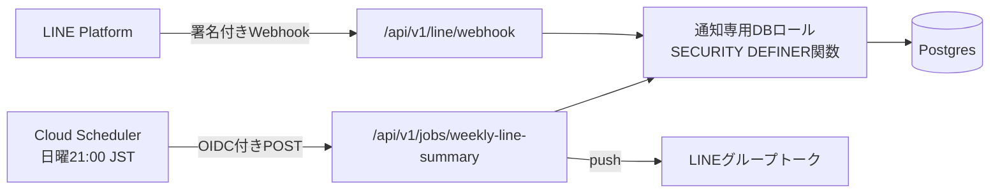

# 週次LINE通知仕様

状態: 実装承認済み

バージョン: 0.1.0

最終更新日: 2026-08-30

## 1. 目的

家計の共有相手が日常的に閲覧するLINEへ、週次の支出集計を自動通知し、アプリを開かなくても家計の振り返りができるようにする。通知はLINEの家族グループトークへのpushとし、利用者判断（2026-08-30）として通知粒度はカテゴリ別内訳まで、頻度は週末の週1回とする。

## 2. 要件

- `NOTIF-001` 毎週日曜21:00（Asia/Tokyo）に、LINE連携済みの家計グループの支出集計をLINEグループトークへpush通知する。
- `NOTIF-002` 通知内容は、対象期間の支出合計、カテゴリ別の金額と件数（金額降順）、前期間の支出合計との比較とする。個人名、支払者・負担者の別、メモ、個別明細は含めない。
- `NOTIF-003` 集計対象期間は送信日を含む直近7日間（月曜〜日曜、`transaction_date`基準、論理削除済みを除く）とする。日曜21:00以降に登録された当日分、および送信後に過去日付で登録・復元・削除された取引は反映しない（再送しない）。
- `NOTIF-004` LINE連携は、botを対象のLINEグループへ招待した際のjoin eventをWebhookで受信して登録する。MVPでは家計グループ1件との単一対応とし、対象の家計グループIDはGit管理外のサーバー環境変数で指定する。botがグループから退出させられた場合（leave event）は連携を解除する。
- `NOTIF-005` LINE Webhookは`X-Line-Signature`（channel secretによるHMAC-SHA256）を検証し、検証失敗・未設定時は本文を処理しない。
- `NOTIF-006` 週次ジョブのエンドポイントはCloud SchedulerのOIDCトークン（Google署名、audienceと呼び出しservice accountのemail）を検証し、検証失敗・未設定時は実行しない。
- `NOTIF-007` 通知処理のDBアクセスは通知専用の最小権限DBロールで行う。ロールは通知用に定義したSECURITY DEFINER関数のEXECUTE権限のみを持ち、テーブルへの直接権限を持たない。Supabaseのservice role keyは導入しない。
- `NOTIF-008` 同一の家計グループ・対象週に対する通知は1回だけ送信する。通知記録を`(group_id, week_start_date)`で一意に保持し、Cloud Schedulerのリトライや多重起動で二重送信しない。
- `NOTIF-009` LINEのchannel secret、channel access token、通知用DB接続文字列はSecret Managerで管理し、コード、Git、ログ、クライアントへ出さない。LINEのgroupIdも識別子としてログ・画面へ出さない。
- `NOTIF-010` 必要な環境変数が未設定の場合、通知機能は安全に無効となり（fail closed）、Webhook・ジョブの各エンドポイントは処理を行わず404を返す。既存機能へ影響しない。

## 3. 通知メッセージ

テキストメッセージ1通とする（Flex Messageは延期）。金額はJPYの整数を3桁区切りで表示する。

```text
【わが家計】今週のまとめ (8/24〜8/30)
支出合計: 34,560円 (12件)
先週: 41,200円 (▲6,640円)

・食費: 18,200円 (6件)
・日用品: 8,360円 (3件)
・交通: 5,000円 (2件)
・娯楽: 3,000円 (1件)
```

- 支出が0件の週は「今週の支出登録はありませんでした。」を送る（連携が生きていることの確認を兼ねる）。
- 収入は通知しない（延期）。

## 4. 構成



- Route Handlerは既存方針どおり「Webhook・外部クライアント向けAPI」として実装する（`05-api-and-application-boundaries.md`）。
- 集計・文面組み立て・期間計算は`src/modules/notifications`のdomain/application層に置き、Route Handlerは薄い検証境界とする。
- DBアクセスはPostgres直接続（通知専用ロール）とし、次の関数だけをEXECUTE可能にする。
  - 週次支出集計の取得
  - LINEグループ連携の登録・解除
  - 通知記録の挿入（一意制約違反時は「送信済み」を返す）
- ロールはmigrationで`NOLOGIN`として作成し、LOGIN権限とpasswordの付与は本番・ローカルとも運用手順として手動で行う（passwordをGitへ含めないため）。

### 4.1 環境変数

| 変数                          | 供給元         | 用途                              |
| ----------------------------- | -------------- | --------------------------------- |
| `LINE_CHANNEL_SECRET`         | Secret Manager | Webhook署名検証                   |
| `LINE_CHANNEL_ACCESS_TOKEN`   | Secret Manager | push送信                          |
| `NOTIFIER_DATABASE_URL`       | Secret Manager | 通知専用ロールの接続文字列        |
| `WEEKLY_SUMMARY_GROUP_ID`     | 環境変数       | 通知対象の家計グループID（UUID）  |
| `WEEKLY_SUMMARY_JOB_AUDIENCE` | 環境変数       | ジョブOIDC検証のaudience          |
| `WEEKLY_SUMMARY_JOB_INVOKER`  | 環境変数       | 許可するCloud Scheduler SAのemail |

## 5. 段階分割

- 段階1（本仕様のPR）: migration、通知module、Webhook・ジョブのRoute Handler、テスト、運用資料。エンドポイントは環境変数未設定なら無効（`NOTIF-010`）のため、先行mergeしても本番の挙動は変わらない。
- 段階2（後続PR）: Terraformによる Cloud Scheduler ジョブ、scheduler用service account、Secret Manager secret container、Cloud Run環境変数の追加。`specs/11-production-infrastructure.md`の更新を伴う。
- 段階3（手動運用）: LINE Developersでのchannel作成、Webhook URL登録、botのグループ招待、secret登録。手順は`docs/operations/`へ記録する。

## 6. 費用

- LINE Messaging APIの無料枠は月200通のpush。週1通×1グループで年間52通のため十分収まる。
- Cloud Schedulerは3ジョブまで無料。本件で1ジョブを使用する。

## 7. 受け入れ条件

- `AC-NOTIF-001-1` 集計期間の算出が、Asia/Tokyoの送信日を含む直近の月曜〜日曜を返し、境界（月初・年末年始）で正しい。
- `AC-NOTIF-001-2` 通知文面が支出合計、カテゴリ別内訳（金額降順）、前週比を仕様の形式で組み立てられ、0件の週は0件用文面になる。金額に浮動小数点を使わない。
- `AC-NOTIF-002-1` 集計に個人名・メモ・明細が含まれない。論理削除済み取引と収入が除外される。
- `AC-NOTIF-004-1` join eventで連携が登録され、leave eventで解除される。group以外のsource（1対1トーク等）は登録しない。
- `AC-NOTIF-005-1` 署名が不正・欠落したWebhook要求は本文を処理せず、署名検証は定数時間比較で行う。
- `AC-NOTIF-006-1` OIDCトークンが不正・欠落・audience不一致・SA不一致のジョブ要求は実行しない。
- `AC-NOTIF-007-1` 通知専用ロールが、許可された関数以外（テーブル直接参照を含む）へアクセスできないことを統合テストで証明する。
- `AC-NOTIF-008-1` 同一グループ・同一週の2回目の送信要求が、LINEへのpushを行わず成功応答で終わる。
- `AC-NOTIF-010-1` 環境変数未設定時に両エンドポイントが404を返し、他機能のテストへ影響しない。

## 8. 管理対象外・延期

- Flex Messageによるリッチ表示、収入・メンバー別の通知、通知のオンオフ設定UI、複数家計グループ対応、LINEからの操作（返信コマンド等）は延期する。
- Slack通知は実装しない（利用者判断でLINEを採用）。

## 9. worktree境界

本変更は専用worktreeと`feat/line-weekly-notification`ブランチで行う。変更を許可する範囲: `specs/`、`supabase/migrations/`、`src/modules/notifications/**`、`src/app/api/v1/line/**`、`src/app/api/v1/jobs/**`、`tests/`、`docs/operations/`、依存追加に伴う`package.json`・lockfile。既存moduleの内部は変更しない。
