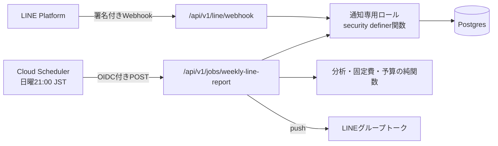

# LINE週次レポート仕様

状態: 承認済み（review: 2026-09-06-line-weekly-report、2026-09-06-line-weekly-report-pricing、2026-09-07-line-weekly-report-main-sync）

バージョン: 0.2.3

最終更新日: 2026-09-07

対象リリース: MVP後・通知フェーズ（[`12-analytics-and-reporting.md`](12-analytics-and-reporting.md)の段階3）

## 1. 目的

家計の共有相手が日常的に閲覧するLINEへ、週に1回、家計の状態を自動で届け、アプリを開かなくても振り返りと予算の確認ができるようにする。通知はLINEの家族グループトークへのpushとし、内容は「今週の支出」「今月の実績」「今月の予算進捗」の3ブロックに限定する。

本仕様は、閉じられたPR #43（`feat/line-weekly-notification`、2026-08-30時点の仕様12版）の設計を引き継ぎ、次の点をmainの現状に合わせて改める。

- 集計を通知側のSQLで再実装せず、画面と同じ純関数（分析・固定費・予算）で計算する（`ANA-012`、`BUD-010`、`REC-005`）。
- カテゴリ内訳を分析画面と同じ「上位5件＋その他のカテゴリ」に丸める（`ANA-004`）。
- 今月の実績（支出・収入・収支）と予算進捗（`BUD-*`）を追加する。
- 仕様番号、レビュー記録、migration名をmainの採番に合わせる。

## 2. 用語

| 用語           | 定義                                                                                                                       |
| -------------- | -------------------------------------------------------------------------------------------------------------------------- |
| 対象週         | 送信日を含む直近の月曜〜日曜の7日間。グループのタイムゾーン上の暦日で判定する                                              |
| 前週           | 対象週の直前の月曜〜日曜                                                                                                   |
| 対象月         | 対象週の日曜が属する月。今月の実績と予算進捗はこの月を対象にする                                                           |
| 支出           | グループ対象の支出。1取引につき1度だけ数え、負担額・支払額・収入を混在させない（`12-analytics-and-reporting.md` §3と同じ） |
| 連携           | 家計グループとLINEグループトークの対応。botがLINEグループへ参加したjoin eventで登録し、退出（leave event）で解除する       |
| 送信枠         | `(group_id, week_start_date)`で一意な送信記録。二重送信防止のために送信前に確保する                                        |
| 通知専用ロール | 通知処理だけが使うDBロール`line_notifier`。通知用に定義した関数のEXECUTE権限だけを持ち、テーブルへの直接権限を持たない     |

## 3. 機能要件

要件IDの正本は[`01-product-requirements.md`](01-product-requirements.md)、受け入れ条件の正本は[`02-use-cases.md`](02-use-cases.md)の`UC-021`とする。

- `NOTIF-001` 毎週日曜21:00（Asia/Tokyo）に、LINE連携済みの家計グループの週次レポートをLINEグループトークへテキスト1通でpush通知する。
- `NOTIF-002` 通知内容は、対象週の支出合計・件数・前週との差額（符号付き。比率は表示しない）・支出カテゴリ上位5件と「その他のカテゴリ」、対象月の支出・収入・収支、予算が設定されている対象月だけ予算額・消化率・残額（超過時は超過額）・状態（順調・注意・超過）と注意または超過状態のカテゴリ予算とする。個人名、支払者・負担者の別、メモ、個別明細は含めない。
- `NOTIF-003` 集計は画面と同じ定義・同じ純関数で行う。単発取引は`transaction_date`基準の未削除の取引、固定費はカレンダーと同じ規則で対象月へ展開した擬似取引として含める。対象月の支出・収入・収支は同じ月・グループ対象の概要分析・ホームカレンダーの月間合計と一致し、予算進捗は予算画面と同じ純関数で計算する。送信後に登録・変更・削除された取引は反映せず、再送しない。
- `NOTIF-004` LINE連携は、botを対象のLINEグループへ招待した際のjoin eventをWebhookで受信して登録する。初回スコープでは家計グループ1件との単一対応とし、対象の家計グループIDはGit管理外のサーバー環境変数で指定する。botがグループから退出させられた場合（leave event）は連携を解除する。
- `NOTIF-005` LINE Webhookは`X-Line-Signature`（channel secretによるHMAC-SHA256）を定数時間比較で検証し、検証失敗・未設定時は本文を処理しない。
- `NOTIF-006` 週次ジョブのエンドポイントはCloud SchedulerのOIDCトークン（Google署名、audience、呼び出しservice accountのemail）を検証し、検証失敗・未設定時は実行しない。
- `NOTIF-007` 通知処理のDBアクセスは通知専用ロールで行う。ロールは通知用に定義した`security definer`関数のEXECUTE権限のみを持ち、テーブルへの直接権限を持たない。関数は集計に必要な最小の列（日付・金額・カテゴリの識別子と表示名・固定費の展開条件・適用中の予算改定）だけを返し、個人名・メモ・支払者・負担者を返さない。Supabaseのservice role keyは導入しない。
- `NOTIF-008` 同一の家計グループ・対象週に対する通知は1回だけ送信する。送信記録を`(group_id, week_start_date)`で一意に保持し、Cloud Schedulerのリトライや多重起動で二重送信しない。
- `NOTIF-009` LINEのchannel secret、channel access token、通知用DB接続文字列はSecret Managerで管理し、コード、Git、ログ、クライアントへ出さない。LINEのgroupIdも識別子としてログ・画面へ出さない。
- `NOTIF-010` 必要な環境変数が未設定の場合、通知機能は安全に無効となり（fail closed）、Webhook・ジョブの各エンドポイントは処理を行わず404を返す。既存機能へ影響しない。

## 4. 集計期間と対象

- 対象週は、送信時点をグループのタイムゾーンで暦日に変換し、その日を含む直近の日曜（当日を含む）を終端、その6日前の月曜を始端とする。日曜21:00の定刻送信では当日が終端になり、月曜以降のリトライでは直前に終わった週を対象にする。
- 前週は対象週の始端から7日前〜1日前とする。
- 対象月は対象週の日曜が属する月とする。週が月をまたぐ場合（例: 8/31〜9/6）は日曜側の月（9月）を対象月にする。
- 読み込む月は、前週の始端が属する月から対象月までの連続した月（最大2か月）とする。集計元の取得関数は安全側の上限として3か月までを受け付け、それを超える範囲は拒否する。
- 集計対象はグループ全体（`scope=group`）だけとし、メンバー別の値を通知しない。

## 5. 通知メッセージ

テキストメッセージ1通とする（Flex Messageは延期）。金額は分析と同じ`￥12,345`形式で、省略・丸めをしない。差額は`＋`・`−`・`±`の符号を付け、色に依存しない。

```text
【わが家】今週のまとめ（8/31〜9/6）
支出 ￥34,560（12件）
先週比 −￥6,640
・食費 ￥18,200
・日用品 ￥8,360
・交通 ￥5,000
・娯楽 ￥3,000
・医療 ￥0
・その他のカテゴリ ￥0（2件）

■ 9月の実績
支出 ￥60,200 / 収入 ￥300,000 / 収支 ＋￥239,800

■ 9月の予算 ￥300,000
消化 20%・残り ￥239,800・順調
・食費 注意（85%）
```

- 先頭行の名称は家計グループ名とする。個人名は含めない。
- 対象週の支出が0件のときは支出行・前週比・カテゴリ行の代わりに「今週の支出登録はありませんでした。」を出す（連携が生きていることの確認を兼ねる）。
- 先週比は前週との差額だけを符号付きで表示し、前週に対する比率は算出・表示しない（`ANA-003`と同じ規則。前週が0円でも差額だけを表示する）。
- カテゴリ行は金額降順で上位5件とし、6件目以降は「その他のカテゴリ」1行へ合算する。上位5件の合計と「その他のカテゴリ」の合計は対象週の支出合計と一致する。
- 「今月の実績」は対象月の支出・収入・収支で、収支は`収入 − 支出`をJPY整数で計算する。取引が0件の月も0円で表示する。
- 「今月の予算」は対象月に適用改定がある場合だけ表示し、予算額、消化率、残額または超過額（`超過 ￥x`）、状態ラベルを1行で示す。カテゴリ予算は状態が注意または超過のものだけを1行ずつ示し、順調のカテゴリは省く。
- 固定費の展開結果は対象週・対象月の支出に含めるが、別項目として表示しない。

## 6. 構成



- Route Handlerは既存方針どおり「Webhook・外部クライアント向けAPI・定期ジョブ」として実装し、薄い検証境界とする（[`05-api-and-application-boundaries.md`](05-api-and-application-boundaries.md)）。
- 期間計算、集計入力への変換、文面組み立て、署名検証は`src/modules/notifications`のdomain層、送信フローとWebhook処理はapplication層に置く。
- 集計は`analytics`モジュールが公開する日付範囲・月の集計純関数、`recurring`モジュールが公開する展開純関数、`budgets`モジュールが公開する予算進捗純関数を、各モジュールの公開エントリーポイント経由で呼ぶ。通知モジュール内で金額を再計算しない。
- 定期ジョブは利用者のsessionを持たないため、共有読み取り境界`listMonthlyTransactions`・`resolveGroupReadContext`（sessionのSupabase clientを前提とする）は使えない。代わりに通知専用ロールの`security definer`関数が同じ条件（グループ・月範囲・未削除）で最小の列を返し、同じ純関数へ渡す。この経路は通知に限定し、画面からは使わない。
- DBアクセスはPostgres直接続（通知専用ロール、処理ごとに接続を閉じる）とし、次の関数だけをEXECUTE可能にする。

| 関数                                      | 用途                                                                         |
| ----------------------------------------- | ---------------------------------------------------------------------------- |
| `app_private.link_line_group`             | join eventで連携を登録・更新する                                             |
| `app_private.unlink_line_group`           | leave eventで連携を解除する                                                  |
| `app_private.get_line_report_target`      | 連携先LINEグループID、グループ名、タイムゾーンを返す（未連携ならIDは`null`） |
| `app_private.get_line_report_source`      | 月範囲の支出・収入の最小列、固定費の展開条件、対象月の適用予算改定を返す     |
| `app_private.claim_weekly_notification`   | 対象週の送信枠を確保する。確保済みなら`false`                                |
| `app_private.release_weekly_notification` | 送信失敗時に送信枠を返上する                                                 |

- ロールはmigrationで`nologin`として作成し、LOGIN権限とpasswordの付与は本番・ローカルとも運用手順として手動で行う（passwordをGitへ含めない）。
- 送信フローは「連携先の取得 → 期間計算 → 集計元の取得 → 純関数で集計・文面組み立て → 送信枠の確保 → push → 失敗時は枠を返上」の順とする。未連携なら集計元を読まずに終了する。

### 6.1 データ

| テーブル                                | 説明                                                             |
| --------------------------------------- | ---------------------------------------------------------------- |
| `app_private.line_notification_targets` | 家計グループ（PK）とLINEグループIDの対応。`linked_at`を持つ      |
| `app_private.weekly_notification_log`   | `(group_id, week_start_date)`をPKとする送信記録。`sent_at`を持つ |

列と制約の詳細は[`04-data-model.md`](04-data-model.md)、関係は[`10-er-diagram.md`](10-er-diagram.md)を正本とする。`app_private`スキーマに置き、`authenticated`・`anon`から参照できない。

### 6.2 環境変数

| 変数                              | 供給元         | 用途                              |
| --------------------------------- | -------------- | --------------------------------- |
| `LINE_CHANNEL_SECRET`             | Secret Manager | Webhook署名検証                   |
| `LINE_CHANNEL_ACCESS_TOKEN`       | Secret Manager | push送信                          |
| `NOTIFIER_DATABASE_URL`           | Secret Manager | 通知専用ロールの接続文字列        |
| `LINE_WEEKLY_REPORT_GROUP_ID`     | 環境変数       | 通知対象の家計グループID（UUID）  |
| `LINE_WEEKLY_REPORT_JOB_AUDIENCE` | 環境変数       | ジョブOIDC検証のaudience（URL）   |
| `LINE_WEEKLY_REPORT_JOB_INVOKER`  | 環境変数       | 許可するCloud Scheduler SAのemail |

## 7. 段階分割

- 段階1（本仕様のPR）: migration、通知module、分析モジュールへの日付範囲集計の追加、Webhook・ジョブのRoute Handler、テスト、運用資料。エンドポイントは環境変数未設定なら無効（`NOTIF-010`）のため、先行mergeしても本番の挙動は変わらない。
- 段階2（後続PR）: Terraformによる Cloud Scheduler ジョブ、scheduler用service account、Secret Manager secret container、Cloud Run環境変数の追加。[`11-production-infrastructure.md`](11-production-infrastructure.md)の更新とレビューを伴う。
- 段階3（手動運用）: LINE公式アカウント・Messaging APIの設定、Webhook URL登録、botのグループ招待、secret登録。手順は[`docs/operations/line-weekly-report.md`](../docs/operations/line-weekly-report.md)に記録する。

## 8. 費用

- LINE Messaging APIのコミュニケーションプラン（日本・無料）は月200通。グループトークへのpushの通数は受信人数で数える。受信者4人に月5回配信する場合は4人×5回＝20通となる。他の配信も含めた月間通数を確認し、無料枠に収まるか判断する（[LINE公式料金・通数計算](https://developers.line.biz/en/docs/messaging-api/pricing/)、2026-09-06確認）。
- Cloud Schedulerは請求先アカウントあたり月3ジョブまで無料。本件で1ジョブを使用するため、既存ジョブと合わせて無料枠を確認する（[Google Cloud公式料金](https://cloud.google.com/scheduler/pricing)、2026-09-06確認）。

## 9. 受け入れ条件

受け入れ条件の正本は[`02-use-cases.md`](02-use-cases.md)の`UC-021`（`AC-NOTIF-001-1`〜`AC-NOTIF-010-1`）とする。

## 10. 管理対象外・延期

- Flex Messageによるリッチ表示、メンバー別・収入内訳の通知、通知のオンオフ設定UI、複数家計グループ対応、LINEからの操作（返信コマンド等）、予算警告の即時push、月末の月次まとめ専用文面は延期する。
- Slack等LINE以外のチャネルは実装しない。
- Webhookのjoin・leave以外のeventのうち、message eventは[`17-line-bug-report.md`](17-line-bug-report.md)（`LBR-*`）が処理する。follow等その他のeventは無視し、応答しない。

## 11. worktree境界

本変更は専用worktreeと`feat/line-weekly-report`ブランチで行う。変更を許可する範囲: `specs/`、`supabase/migrations/`、`src/modules/notifications/**`、`src/modules/analytics/domain/analytics-summary.ts`と`src/modules/analytics/index.ts`（日付範囲集計と公開エントリーポイントの追加のみ）、`src/app/api/v1/line/**`、`src/app/api/v1/jobs/**`、`tests/`、`docs/operations/`、`README.md`、依存追加に伴う`package.json`・lockfile。他モジュールの内部は変更しない。
