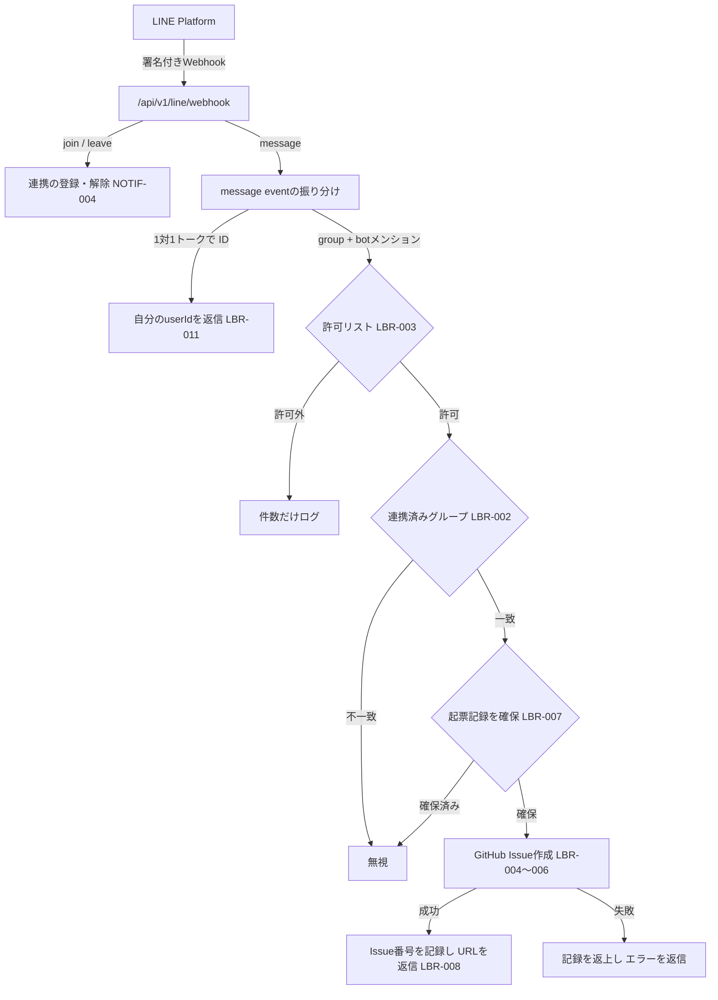

# LINE不具合報告（メンションからのIssue自動起票）仕様

状態: 承認済み（review: 2026-09-07-line-bug-report）

バージョン: 0.1.0

最終更新日: 2026-09-07

対象リリース: MVP後・通知フェーズ（[`16-line-weekly-report.md`](16-line-weekly-report.md)の基盤を再利用する）

## 1. 目的

家族のLINEグループトークでbot（LINE公式アカウント）をメンションして不具合や要望を書き込むと、その本文をもとに本リポジトリへGitHub Issueを自動作成し、Issue URLをLINEへ返信する。利用者はスマートフォンのLINEから離れずに不具合を報告でき、開発側は報告をIssueとして一元管理できる。

初回スコープはIssue作成までとし、LLMによる本文整形・穴埋め、修正PRの自動作成、Push通知は含めない。

本仕様は[`16-line-weekly-report.md`](16-line-weekly-report.md)（LINE週次レポート、`NOTIF-*`）が用意したWebhook Route Handler、署名検証、LINE Messaging APIクライアント、通知専用ロール`line_notifier`、fail closedの環境変数判定を再利用し、重複実装しない。

## 2. 用語

| 用語       | 定義                                                                                                                |
| ---------- | ------------------------------------------------------------------------------------------------------------------- |
| bot        | 週次レポートと同じLINE公式アカウント（Messaging API channel）。同じchannel secret・access tokenを使う               |
| メンション | LINEのtextメッセージで`message.mention.mentionees`に含まれる言及。botへの言及は`isSelf: true`で判別する             |
| 起票要求   | 連携済みLINEグループトークで、botをメンションしたtextメッセージ                                                     |
| 報告者     | 起票要求を送信したLINEユーザー。`source.userId`で識別する                                                           |
| 許可リスト | 起票を許可するLINE userIdの一覧。Git管理外のサーバー設定（Secret Manager）で指定する                                |
| 起票記録   | `message.id`ごとの処理記録。LINEのWebhook再送やCloud Runの多重起動で同じ本文のIssueを複数作らないための冪等化に使う |
| 返信       | `replyToken`によるReply API（無料）での応答。Push APIは使わない                                                     |

## 3. 機能要件

要件IDの正本は[`01-product-requirements.md`](01-product-requirements.md)、受け入れ条件の正本は[`02-use-cases.md`](02-use-cases.md)の`UC-022`とする。

- `LBR-001` LINEグループトークで受信した`message` eventのうち、`mode === "active"`、`message.type === "text"`、かつ`message.mention.mentionees`にbot自身（`isSelf: true`）が含まれるものだけを起票要求とする。メンションのないメッセージ、`@All`のみのメッセージ、スタンプ・画像などの非text、standby modeのeventは処理せず、Webhookは200を返す。本文からはメンション部分（`index`・`length`の範囲）を除去し、前後の空白を取り除く。除去後の本文が空のときは起票せず、内容を書くよう案内を返信する。
- `LBR-002` 起票要求は`source.type === "group"`で、かつ`NOTIF-004`で連携済みのLINEグループ（`app_private.line_notification_targets`のLINE groupIdと一致）からのものに限る。1対1トーク、未連携グループ、複数人トーク（room）からのメンションは処理しない。
- `LBR-003` 報告者の`source.userId`が許可リストに含まれる場合だけ起票する。許可外の報告者には起票も返信も行わず、監査用に「許可外の起票要求が何件あったか」だけをログへ記録する。ログにuserId・本文・LINE groupIdを含めない。
- `LBR-004` Issue本文は固定テンプレートで組み立てる。「概要」にはメンションを除いた本文を、Markdownの見出し・リンク・引用・GitHubのメンション（`@user`）・Issue参照（`#123`）として解釈されないよう、本文中の最長のbacktick連続より長いfenceのコードブロックに入れて転記する。「再現手順」「期待する動作」「実際の動作」「影響範囲」「重要度」は「（LINEからの報告のため未記入。確認後に追記する）」とする。「報告元」にはLINEの`message.id`と受信日時（UTC、eventの`timestamp`）だけを記載し、LINE userId・表示名・groupId・家計データを付加しない。本文はLLMで整形せず、そのまま転記する。
- `LBR-005` Issueタイトルは`bug(line): <本文の最初の空でない行の先頭60文字>`とする（文字数はUnicodeコードポイント単位）。ラベル`bug`と`source:line`を付与する。対象リポジトリ（`owner/repo`）はサーバー環境変数で指定し、クライアントや本文から受け取らない。
- `LBR-006` GitHubへの起票はIssues: Read and write権限だけを持つFine-grained personal access tokenで行う。トークンはSecret Managerで管理し、コード・Git・ログ・クライアント・エラーメッセージへ出さない。Cloud Runは`latest`ではなく指定versionを参照する（`INF-019`と同方式）。GitHub API呼び出しはHTTPS、`Authorization: Bearer`、`User-Agent`、`X-GitHub-Api-Version`を付け、上限時間（10秒）を設ける。
- `LBR-007` 同一`message.id`に対する起票は1回だけ行う。起票前に`app_private.line_issue_reports`へ`message.id`の起票記録を確保（claim）し、確保できなければ何もしない。GitHubで起票に失敗した場合は記録を返上（release）し、成功した場合はIssue番号を記録（complete）する。LINEのWebhook再送やCloud Runの多重起動で同じ本文のIssueを複数作らない。
- `LBR-008` 起票に成功した場合は`replyToken`でIssue番号とURLを返信し、失敗した場合は「起票できませんでした」と返信する。返信にはReply APIだけを使い、Push APIの無料枠を消費しない。返信自体の失敗はWebhookのエラーにしない。
- `LBR-009` Webhookは1要求内の起票要求を順に同期処理し、GitHub・LINEの各呼び出しに上限時間を設けたうえで、失敗・タイムアウト時もWebhook自体は200を返す。Next.jsの`after()`（応答後処理）は使わない。Cloud Runはrequest-based billing（`INF-004`、CPUは要求処理中だけ割り当て）のため、応答後の処理が完了する保証がないためである。応答遅延でLINEが再送した場合は`LBR-007`が二重起票を防ぐ。
- `LBR-010` 起票用の環境変数（GitHubトークン`LINE_BUG_REPORT_GITHUB_TOKEN`、対象リポジトリ`LINE_BUG_REPORT_GITHUB_REPOSITORY`、許可リスト`LINE_BUG_REPORT_ALLOWED_USER_IDS`）が1つでも未設定または不正な場合、この機能は安全に無効となり（fail closed）、メンション付きメッセージを受信しても起票・返信しない。週次レポート（`NOTIF-*`）の挙動・テストには影響しない。Webhook自体が有効になる条件（`NOTIF-010`の環境変数）は変更しない。
- `LBR-011` 許可リストへ登録するLINE userIdを利用者が安全に知るため、botとの1対1トーク（`source.type === "user"`）で本文が`ID`（大文字小文字を区別しない、前後空白を除く）のtextメッセージを受信したときだけ、送信者自身の`source.userId`をReply APIで返信する。他人のuserIdを返さず、グループトークでは応答せず、userIdをログへ出さない。この応答はWebhookが有効（`NOTIF-010`）なら起票用環境変数の有無にかかわらず行う（許可リストを登録する前にuserIdを知る必要があるため）。

## 4. 処理フロー



Webhook Route Handlerは、署名検証（`NOTIF-005`）の後にjoin/leave（既存）を処理し、続けてmessage eventを処理する。起票用環境変数が揃っていない場合、message eventのうち起票要求は処理せず、`LBR-011`のuserId応答だけを行う。

## 5. 文面

返信はすべてテキスト1通とする。

| 場面             | 文面                                                                                    |
| ---------------- | --------------------------------------------------------------------------------------- |
| 起票成功         | `不具合Issueを作成しました。` 改行 `#<番号> <URL>`                                      |
| 起票失敗         | `起票できませんでした。時間をおいて再度お試しください。`                                |
| 本文が空         | `報告内容が空です。メンションの後に不具合の内容を書いてください。`                      |
| 1対1トークで`ID` | `あなたのLINE userIdです。起票を許可する場合は管理者へ伝えてください。` 改行 `<userId>` |

Issue本文のテンプレート:

````markdown
## 概要

```text
<メンションを除いた本文>
```

## 再現手順

（LINEからの報告のため未記入。確認後に追記する）

## 期待する動作

（LINEからの報告のため未記入。確認後に追記する）

## 実際の動作

（LINEからの報告のため未記入。確認後に追記する）

## 影響範囲

（LINEからの報告のため未記入。確認後に追記する）

## 重要度

（LINEからの報告のため未記入。確認後に追記する）

## 報告元

- 経路: LINEグループトーク（botへのメンション）
- LINE message.id: `<message.id>`
- 受信日時（UTC）: <ISO 8601>
````

## 6. 構成

- Route Handlerは既存の`src/app/api/v1/line/webhook/route.ts`を使い、新しいエンドポイントを追加しない。
- メンション抽出・本文整形・タイトル生成・返信文は`src/modules/notifications`のdomain層、起票フロー（許可リスト → 連携確認 → 起票記録 → GitHub → 返信）はapplication層、GitHub Issues APIクライアント・Reply API・環境変数読込・DB関数呼び出しはinfrastructure層に置く。
- DBアクセスは`NOTIF-007`と同じく通知専用ロール`line_notifier`のPostgres直接続で行い、次の`security definer`関数だけをEXECUTE可能にする。テーブルへの直接権限は付与しない。

| 関数                                     | 用途                                                                                       |
| ---------------------------------------- | ------------------------------------------------------------------------------------------ |
| `app_private.claim_line_issue_report`    | `message.id`の起票記録を確保する。既に存在すれば`false`                                    |
| `app_private.complete_line_issue_report` | 起票成功後にIssue番号を記録する                                                            |
| `app_private.release_line_issue_report`  | 起票失敗時に未完了の記録だけを削除し、次の要求で再度起票できるようにする（完了済みは残す） |

- 連携済みグループの判定には既存の`app_private.get_line_report_target`を使う。

### 6.1 データ

| テーブル                         | 説明                                                                                         |
| -------------------------------- | -------------------------------------------------------------------------------------------- |
| `app_private.line_issue_reports` | `line_message_id`（PK）、家計グループ、受信日時、Issue番号、確保・完了日時。本文は保存しない |

列と制約の詳細は[`04-data-model.md`](04-data-model.md)、関係は[`10-er-diagram.md`](10-er-diagram.md)を正本とする。

### 6.2 環境変数

| 変数                                | 供給元         | 用途                                                   |
| ----------------------------------- | -------------- | ------------------------------------------------------ |
| `LINE_BUG_REPORT_GITHUB_TOKEN`      | Secret Manager | Issue作成（Issues: Read and writeのみ）                |
| `LINE_BUG_REPORT_ALLOWED_USER_IDS`  | Secret Manager | 起票を許可するLINE userIdのカンマ区切り一覧（1件以上） |
| `LINE_BUG_REPORT_GITHUB_REPOSITORY` | 環境変数       | 対象リポジトリ`owner/repo`                             |

LINE channel secret・access token・通知用DB接続文字列は週次レポートの環境変数（`16-line-weekly-report.md` §6.2）を共有する。

### 6.3 入力の検証

- LINE `message.id`は`^[0-9A-Za-z_-]{1,64}$`、`userId`は`^U[0-9a-f]{32}$`、groupIdは`NOTIF-004`と同じ`^[0-9A-Za-z_-]{1,64}$`で検証し、不正な形式のeventは無視する。
- 対象リポジトリは`^[A-Za-z0-9_.-]+/[A-Za-z0-9_.-]+$`で検証する。
- 許可リストは重複のない有効なuserId 1件以上でなければ全体を無効（fail closed）にする（許可Googleアカウントと同じ規則）。
- LINE本文は外部入力として扱い、Issue本文へはコードブロック内にのみ転記する。GitHub APIへの送信以外に本文を保存・ログ出力しない。

## 7. 段階分割

| 段階  | 内容                                                                              | 主な作業場所        |
| ----- | --------------------------------------------------------------------------------- | ------------------- |
| 段階1 | アプリ実装（message event処理、Issue作成、返信）とDB migration（本仕様のPR）      | このリポジトリ      |
| 段階0 | migrationの本番適用と段階1 PRのmerge                                              | 本番DB + GitHub     |
| 段階2 | Terraform（secret container 2つ、`line_bug_report`変数、Cloud Run環境変数3つ）    | `infra/terraform/`  |
| 段階3 | GitHubトークン発行、許可LINE userId取得、Secret Managerへの登録、有効化、動作確認 | GitHub + GCP + LINE |

段階1・2は`INF-021`と同じくfail closedを保ち、変数未設定・環境変数未設定では本番の挙動が変わらない。段階2の要件は[`11-production-infrastructure.md`](11-production-infrastructure.md)へ`INF-022`以降として追加し、別PRでレビューする。各段階の手順と「現在地」は[`docs/operations/line-bug-report.md`](../docs/operations/line-bug-report.md)に記録する。

## 8. 費用・運用

- LINE Messaging API: Webhook受信とReply APIは無料。Push APIは使わない。
- GitHub API: 無料。Fine-grained tokenの有効期限（最長1年）のローテーション手順を運用資料に記載する。
- Secret Manager: 本機能でアクティブversionが2件増える。無料枠（アクティブversion 6件）を超える場合の月額と、旧versionをdisable/destroyしてアクティブ数を抑える手順を運用資料に記載する。
- Cloud Run: 既存サービスへの処理追加のため追加費用は発生しない。min instances 0のコールドスタートでLINEの応答期限に掛かり得るため、LINE側の「Webhookの再送」を有効にし、`LBR-007`で二重起票を吸収する。
- 対象リポジトリは公開リポジトリのため、本文はそのまま公開される。金額・店名・氏名などの家計データや個人情報を本文へ書かない運用ルールを家族へ共有する（運用資料）。

## 9. 受け入れ条件

受け入れ条件の正本は[`02-use-cases.md`](02-use-cases.md)の`UC-022`（`AC-LBR-001-1`〜`AC-LBR-011-1`）とする。

## 10. 管理対象外・延期

- LLM（Claude API等）による本文の整形・項目の穴埋め・確認質問、修正PRの自動作成、PR作成完了などのPush通知、1対1トークからの起票、画像・スクリーンショットの添付、Issueの更新・クローズ操作、重複Issueの検出は延期する。
- 週次レポートの文面・送信ロジック、Cloud Scheduler job、`line_weekly_report`変数、既存のCloud Run構成、Production CDは変更しない。

## 11. worktree境界

本変更は専用worktreeと`feat/line-bug-report`ブランチ（`feat/line-weekly-report-infra`を基点とするstacked PR）で行う。変更を許可する範囲: `specs/`、`supabase/migrations/202609070001_line_bug_report.sql`、`src/modules/notifications/**`、`src/app/api/v1/line/webhook/route.ts`、`tests/`、`docs/operations/line-bug-report.md`、`README.md`。`infra/terraform/**`は段階2の別ブランチで変更し、他モジュールの内部、CI/CD workflow、`package.json`とlockfileは変更しない。
